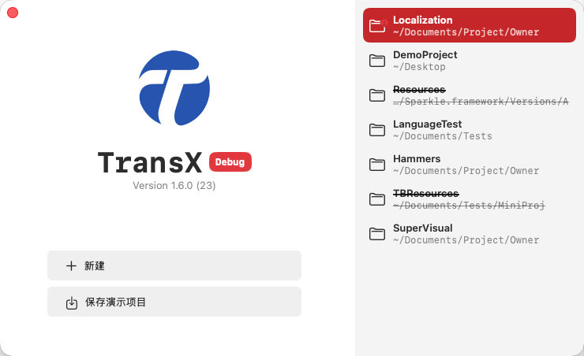

# 欢迎页面

## 概述

TransX 的欢迎页面是应用启动后首先展示的界面,设计风格类似于 Xcode 的启动页面,为用户提供便捷的项目访问和管理入口。该页面采用简洁直观的布局,将项目历史记录和功能入口清晰地分置于左右两侧。

## 界面布局

### 右侧 - 项目历史区域

右侧区域展示您最近打开过的 Xcode 多语言项目列表。这些项目记录会自动保存,方便您快速访问常用项目。

#### 项目信息显示

每个项目记录包含以下信息:
- **项目名称**: 显示项目所在文件夹的名称,作为项目的主要标识
- **项目路径**: 显示相对于用户主目录(~)的相对路径,便于识别项目位置

#### 交互操作

**双击打开**: 
- 直接双击任意项目记录即可快速打开该项目

**右键菜单**: 
对项目记录点击右键,可使用以下功能:

1. **打开**  
   打开选中的多语言项目,进入主工作窗口开始编辑管理

2. **定位**  
   在 Finder 中打开该项目所在的本地目录,方便查看项目文件结构

3. **删除**  
   从历史记录中移除该项目记录(不会删除实际项目文件)
   - 适用场景: 清理不再使用的项目记录,保持列表整洁
   - 注意: 仅删除访问记录,不影响本地项目文件

### 左侧 - 功能入口区域

左侧区域提供了主要的功能入口按钮,支持创建新项目和体验演示功能。

#### 主要功能

**新建项目**  
点击"新建项目"按钮,启动项目创建向导:
- 选择 Xcode 项目路径
- 配置 .strings 文件筛选规则
- 设置解析参数和常量配置
- 完成后进入项目管理界面

**演示项目**  
提供演示项目功能,帮助新用户快速了解工具的使用方法:
- 可将演示项目保存到本地
- 体验完整的多语言管理流程
- 了解各项功能的实际应用场景

## 使用建议

### 项目记录管理
- 定期清理不再使用的项目记录,保持历史列表的整洁性
- 对于频繁访问的项目,可通过双击快速打开,提高工作效率
- 使用"定位"功能可以快速在 Finder 中查看项目文件

### 新用户指引
- 首次使用建议先体验演示项目,熟悉工具的核心功能
- 了解基本操作流程后,再使用"新建项目"功能处理实际项目
- 阅读相关文档,掌握高级功能的使用方法

### 快捷访问
- 历史记录按最近使用时间排序,最新的项目显示在最前面
- 支持通过 Command+O 快捷键直接打开项目选择对话框
- 可使用 Command+Shift+O 快捷键随时返回此欢迎页面

## 技术细节

### 项目路径处理
- 路径使用波浪号(~)表示用户主目录,使显示更加简洁
- 支持识别和处理软链接、别名等特殊路径
- 自动检测项目是否仍然存在于原路径

### 历史记录持久化
- 项目访问记录自动保存在应用的配置文件中
- 跨应用启动保持历史记录
- 支持清理无效的项目记录(项目已被删除或移动)

欢迎页面是您使用 TransX 的起点,通过这个简洁而功能完善的界面,您可以快速开始多语言本地化工作。
