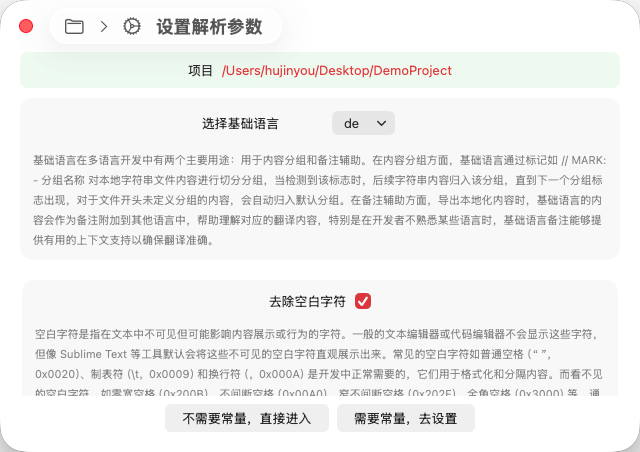

# 新建项目

TransX 的新建项目向导采用分步式交互设计，帮助您快速完成项目的初始化配置。整个窗口界面清晰地划分为三个功能区域：

1. **顶部导引区**：提供可视化的步骤导航，您可以通过点击步骤标识快速返回到之前的任何配置步骤，无需重新开始整个流程

2. **中间配置区**：这是核心的交互区域，根据当前所处步骤展示相应的配置选项和参数设置界面
3. **底部操作区**：提供流程控制按钮，您可以选择进入下一步继续配置，或者在配置完成后直接进入项目开始工作

这种分步式的设计既保证了配置的完整性，又提供了足够的灵活性，让您可以随时调整之前的设置。

## 1 项目选择


项目选择是新建流程的第一步，这个页面的主要功能是帮助您定位 Xcode 项目并确定多语言文件的扫描范围。在这里，您需要选择 Xcode 项目的根目录，TransX 将基于此目录开始扫描和管理所有的 `.strings` 文件。

为了提供更精确的文件检索能力，该页面提供了两个重要的筛选选项：

### 🔍 搜索目录

搜索目录功能允许您精确控制 TransX 扫描 `.strings` 文件的范围：

- **未选择任何目录（默认行为）**：工具将从项目根目录开始，递归搜索整个项目结构中的所有 `.strings` 文件。这种方式适用于项目初次使用 TransX 或不确定本地化文件分布位置的场景。
  
- **选择特定目录**：如果您的项目结构清晰，本地化文件集中在某些特定目录中（例如 `Resources/Localizations`），您可以精确指定一个或多个目录。此时，工具将仅在这些指定目录及其子目录中搜索 `.strings` 文件，大大提高扫描效率，避免扫描不必要的路径。

这种选择性扫描机制在大型项目中尤其有用，可以显著减少扫描时间，并避免误扫描第三方库或临时文件中的 `.strings` 文件。

### 🚫 忽略目录

忽略目录功能提供了一种排除机制，用于跳过不需要管理的目录：

- **工作原理**：当您指定了需要忽略的目录后，TransX 在扫描过程中遇到这些目录时将直接跳过，不会进入其内部进行任何文件检索和处理。

- **典型应用场景**：
  - 排除第三方依赖目录（如 `Pods`、`Carthage`、`Package Dependencies`）
  - 跳过构建输出目录（如 `DerivedData`、`Build`）
  - 忽略临时文件目录或测试数据目录
  - 避免扫描已废弃但尚未删除的旧版本代码目录

- **性能优化**：合理使用忽略目录功能不仅可以避免管理不必要的文件，还能显著提升扫描速度，特别是在包含大量第三方库的项目中。

### 配置完成

完成目录配置后，点击底部的"**检索**"按钮，TransX 将根据您的配置开始扫描 `.strings` 文件，并进入下一步的参数设置环节。

## 2 设置解析参数



解析参数配置是项目初始化的关键步骤，这些参数将直接影响 TransX 如何理解和处理您的 `.strings` 文件内容。本步骤提供了两个核心配置选项：

### 1. 基础语言（Base Language）

基础语言是多语言项目管理的核心概念，在 TransX 中扮演着双重角色：

#### 内容分组功能

基础语言对应的 `.strings` 文件承担着内容组织的重要职责。TransX 通过识别 Xcode 标准的 MARK 注释来实现分组管理：

```swift
// MARK: - 用户界面
"button.login" = "登录";
"button.logout" = "登出";

// MARK: - 错误提示
"error.network" = "网络连接失败";
"error.timeout" = "请求超时";
```

**分组规则详解**：
- 当 TransX 检测到 `// MARK: - 分组名称` 标记时，会创建一个新的逻辑分组
- 该标记之后、下一个 MARK 标记之前的所有本地化字符串都归入当前分组
- 对于文件开头未定义任何 MARK 标记的内容，TransX 会自动将其归入"默认分组"（Default Group），确保所有内容都有明确的归属
- 这种分组机制完全遵循 Xcode 的代码组织惯例，使本地化管理与项目代码结构保持一致

**分组的实际价值**：
- 便于按功能模块查找和编辑相关的本地化内容
- 在大型项目中，通过分组可以快速定位特定功能的多语言文本
- 团队协作时，不同成员可以专注于各自负责模块的本地化工作

#### 备注辅助功能

基础语言在导出和翻译流程中提供重要的上下文支持：

- **翻译辅助**：当导出本地化内容（如 CSV、JSON 格式）时，基础语言的文本会自动作为参考备注附加到其他语言项中。这对翻译人员至关重要，特别是在处理上下文依赖性强的短语时。

- **多语言对照**：在 TransX 的编辑界面中，基础语言内容始终可见，作为其他语言翻译的参照基准。即使开发者不熟悉某种目标语言，通过基础语言的对照也能判断翻译的准确性。

- **版本追踪**：基础语言通常作为文案的"源头"，所有本地化变更都基于基础语言进行。这使得内容变更追踪和版本管理更加清晰。

**最佳实践建议**：
> 基础语言应该设置为团队最熟悉的语言，通常是开发者的母语或项目的主要市场语言。这样可以确保：
> - 文案表达最准确、最自然
> - 分组命名清晰易懂
> - 为其他语言翻译提供最可靠的参照

### 2. 去除空白字符（Whitespace Trimming）

空白字符处理是确保多语言内容一致性和可靠性的重要功能。

#### 空白字符的类型和影响

**可见空白字符**（正常使用）：
- 普通空格（Space，U+0020）
- 制表符（Tab，U+0009）
- 换行符（Line Feed，U+000A）

这些字符在代码编辑器中可见或可通过格式化工具显示，是文本格式化的必要组成部分。

**不可见空白字符**（潜在问题源）：
- 零宽空格（Zero Width Space，U+200B）
- 不间断空格（Non-Breaking Space，U+00A0）
- 窄不间断空格（Narrow No-Break Space，U+202F）
- 全角空格（Ideographic Space，U+3000）
- 字节顺序标记（BOM，U+FEFF）
- 零宽连接符（Zero Width Joiner，U+200D）

**实际问题案例**：

```swift
// 案例1：零宽空格导致的字符串比较失败
let key1 = "user.name"      // 正常字符串
let key2 = "user​.name"      // 包含零宽空格（在 . 前）
if key1 == key2 {           // 永远不会相等！
    // 这段代码永远不会执行
}

// 案例2：不可见空格导致的 UI 异常
"button.title" = "确认​​​";   // 看起来正常，实际包含多个零宽空格
// 在 UI 上可能导致按钮文字位置偏移或尺寸计算错误
```

**数据来源**：
这些不可见字符可能通过多种途径进入代码：
- 从网页或文档复制粘贴文本
- 使用某些文本编辑器或翻译工具
- 自动化工具或脚本生成的内容
- 第三方翻译服务返回的结果

#### TransX 的处理机制

启用"去除空白字符"功能后，TransX 将在以下时机自动检测和清理不可见空白字符：

1. **项目初始化时**：自动扫描并清理所有 `.strings` 文件和相关常量文件中的隐藏空白字符
2. **内容新增时**：当添加新的本地化条目时，实时检测并清理输入内容
3. **内容编辑时**：在保存修改时自动处理，确保持久化的数据是干净的
4. **导入外部数据时**：从 CSV、JSON 等外部格式导入内容时，自动进行清理

**处理结果透明化**：
所有空白字符清理操作都会在日志区域详细记录，包括：
- 在哪个文件中发现了问题字符
- 具体清理了哪些类型的空白字符
- 清理的字符数量和位置
- 处理的时间戳

这种透明的处理机制让您可以完全掌控数据清理过程，并在需要时进行审查。

### 下一步选择

完成参数配置后，您需要决定是否启用常量模式：

- **"不需要常量，直接进入"**：TransX 将立即开始解析筛选到的 `.strings` 文件，完成后直接进入主应用界面。这种方式适合小型项目或快速查看本地化内容的场景。

- **"需要常量，去设置"**：进入常量配置步骤，设置代码常量的生成规则。**强烈推荐用于生产环境项目**，以获得类型安全和代码维护性的保障。

## 3 设置常量


常量模式是 TransX 为 iOS/macOS 开发提供的一项核心功能，旨在通过类型安全的方式管理本地化字符串键值，从根本上解决直接使用字符串字面量带来的维护和安全问题。

### 常量模式的必要性

在传统的 Xcode 本地化开发中，我们通常将本地化字符串存储在 `Localizable.strings` 文件中：

```swift
// Localizable.strings
"com.app.user.login.button" = "Login";
"com.app.user.logout.button" = "Logout";
"com.app.settings.title" = "Settings";
```

在代码中直接使用字符串键值进行本地化：

```swift
// 传统方式 - 直接使用字符串
let loginText = NSLocalizedString("com.app.user.login.button", comment: "")
let settingsTitle = NSLocalizedString("com.app.settings.title", comment: "")

// 或使用自定义的本地化宏
let loginText = LL("com.app.user.login.button")
```

这种方式存在多个严重问题：

#### 问题 1：编译期无法检测拼写错误

```swift
// 正确的键
let text1 = LL("com.app.user.login.button")

// 拼写错误 - 编译器不会报错！
let text2 = LL("com.app.user.login.buton")  // buton 拼写错误
let text3 = LL("com.app.user.longin.button") // longin 拼写错误

// 这些错误只会在运行时显示空字符串或 key 本身
```

在大型项目中，这类错误难以发现，往往要到 QA 测试或用户反馈时才会暴露。

#### 问题 2：重构和维护困难

当需要重命名或重组本地化键值时：

```swift
// 假设这个 key 在 50 个文件中使用了 100 次
"com.app.user.login.button" = "Login"

// 现在需要改为更清晰的命名
"button.user.login" = "Login"

// 你需要：
// 1. 找到所有使用旧 key 的地方（全局搜索）
// 2. 逐一手动替换
// 3. 确保没有遗漏
// 4. 祈祷没有引入新的拼写错误
```

这种维护工作耗时且容易出错。

#### 问题 3：代码可读性差

```swift
// 看到这些代码，你能立即知道它们的用途吗？
titleLabel.text = LL("com.app.user.profile.edit.title")
button.setTitle(LL("com.app.user.profile.edit.save"), for: .normal)
alertMessage = LL("com.app.user.profile.edit.validation.error")

// 长字符串降低了代码的可读性
// 特别是在有多个本地化调用的代码块中
```

#### 问题 4：团队协作中的一致性问题

```swift
// 开发者 A 使用：
LL("com.app.settings.title")

// 开发者 B 可能因为记忆错误使用：
LL("com.app.setting.title")  // 少了 's'

// 或者：
LL("settings.title")  // 使用了不同的命名约定

// 结果是多个相似但不同的 key，导致内容重复和管理混乱
```

### 常量模式的解决方案

TransX 的常量模式通过自动生成类型安全的常量来解决这些问题：

```swift
// TransX 自动生成的常量文件（示例）
// LocalizationKeys.swift

struct LocalizationKeys {
    struct User {
        struct Login {
            static let button = "com.app.user.login.button"
            static let title = "com.app.user.login.title"
        }
        struct Logout {
            static let button = "com.app.user.logout.button"
        }
    }
    
    struct Settings {
        static let title = "com.app.settings.title"
        static let description = "com.app.settings.description"
    }
}

// 或者使用更简洁的命名（可配置）
let lUserLoginButton = "com.app.user.login.button"
let lUserLogoutButton = "com.app.user.logout.button"
let lSettingsTitle = "com.app.settings.title"
```

在代码中使用常量：

```swift
// 方式1：使用嵌套结构
let loginText = LL(LocalizationKeys.User.Login.button)
let settingsTitle = LL(LocalizationKeys.Settings.title)

// 方式2：使用简洁常量
let loginText = LL(lUserLoginButton)
let settingsTitle = LL(lSettingsTitle)
```

### 常量模式的核心优势

#### 1. 编译期类型检查

```swift
// ✅ 正确 - 编译通过
let text = LL(lUserLoginButton)

// ❌ 错误 - 编译失败，Xcode 会立即标红
let text = LL(lUserLoginButon)  // 常量名拼写错误
```

任何拼写错误都会被 Swift 编译器立即捕获，将运行时错误提前到编译期。

#### 2. 自动代码补全

```swift
// 输入 "lUser"，Xcode 自动补全显示：
// - lUserLoginButton
// - lUserLoginTitle  
// - lUserLogoutButton
// - lUserProfileTitle
// ...

// 无需记忆完整的 key 字符串
// 避免查找 .strings 文件
// 大幅提升开发效率
```

#### 3. 安全重构

```swift
// 需要重命名？
// 使用 Xcode 的 "Refactor -> Rename"
// 所有引用该常量的地方会自动更新
// 完全不用担心遗漏或错误
```

TransX 会同步更新 `.strings` 文件和常量文件，保证一致性。

#### 4. 增强的代码可读性

```swift
// 对比：

// ❌ 使用字符串 - 需要猜测或查找才知道含义
titleLabel.text = LL("com.app.user.profile.edit.title")

// ✅ 使用常量 - 语义清晰
titleLabel.text = LL(lUserProfileEditTitle)
```

常量名通常比反向域名风格的 key 更具描述性和可读性。

#### 5. 集中化管理

```swift
// 所有本地化 key 定义在一个或几个常量文件中
// 团队成员可以快速浏览所有可用的本地化内容
// 避免重复定义相似的 key
// 便于制定和遵循命名规范
```

#### 6. 防止魔法字符串

```swift
// ❌ 魔法字符串散落在代码各处
func updateUI() {
    label.text = LL("com.app.welcome")
    button.setTitle(LL("com.app.button.ok"), for: .normal)
}

// ✅ 使用常量，代码更专业更易维护
func updateUI() {
    label.text = LL(lWelcomeMessage)
    button.setTitle(LL(lButtonOK), for: .normal)
}
```

#### 7. 团队协作保障

```swift
// 所有开发者使用相同的常量
// 不会因为记忆错误产生不同的 key
// 代码审查时更容易发现问题
// 新成员上手更快
```

### 常量配置页面详解

在这个配置页面中，TransX 会列出第一步扫描到的所有 `.strings` 文件，您可以为每个文件单独配置常量生成规则。

#### 配置选项 1：常量文件路径

为每个 `.strings` 文件指定对应的常量输出文件：

- **Objective-C 项目**：可以指定 `.h` 和 `.m` 文件对
  ```objc
  // LocalizationKeys.h
  extern NSString * const kUserLoginButton;
  extern NSString * const kUserLogoutButton;
  
  // LocalizationKeys.m
  NSString * const kUserLoginButton = @"com.app.user.login.button";
  NSString * const kUserLogoutButton = @"com.app.user.logout.button";
  ```

- **Swift 项目**：可以指定单个 `.swift` 文件
  ```swift
  // LocalizationKeys.swift
  let lUserLoginButton = "com.app.user.login.button"
  let lUserLogoutButton = "com.app.user.logout.button"
  ```

- **混合项目**：可以同时生成两种格式，满足混编项目的需求

**路径选择建议**：
- 将常量文件放在项目的 `Constants` 或 `Localization` 目录下
- 为不同的 `.strings` 文件生成独立的常量文件，保持代码结构清晰
- 确保常量文件已添加到 Xcode 项目中，以便编译器识别

#### 配置选项 2：常量样式（Constant Style）

TransX 提供三种常量生成样式，以适应不同的开发场景：

##### Normal（标准字符串）

生成标准的 `String` 类型常量：

```swift
let lButtonLogin = "button.login"
let lErrorMessage = "error.message"

// 使用方式
let text = NSLocalizedString(lButtonLogin, comment: "")
label.text = LL(lButtonLogin)
```

**适用场景**：
- 通用场景，最灵活的方式
- 可以用于任何接受 `String` 参数的 API
- 兼容性最好

##### LocalizedStringKey（SwiftUI 专用）

生成 `LocalizedStringKey` 类型常量，SwiftUI 的本地化专用类型：

```swift
let lButtonLogin: LocalizedStringKey = "button.login"
let lWelcomeMessage: LocalizedStringKey = "welcome.message"

// SwiftUI 使用方式
struct ContentView: View {
    var body: some View {
        VStack {
            Text(lButtonLogin)  // 自动本地化
            Button(lWelcomeMessage) { }  // 自动本地化
        }
    }
}
```

**适用场景**：
- SwiftUI 项目
- `Text`、`Button`、`Label` 等 SwiftUI 视图直接支持
- 利用 SwiftUI 的自动本地化机制
- 更简洁，无需显式调用 `NSLocalizedString`

**优势**：
```swift
// ✅ 使用 LocalizedStringKey
Text(lWelcomeMessage)  // 简洁

// vs

// ❌ 使用普通 String 
Text(NSLocalizedString(lWelcomeMessage, comment: ""))  // 繁琐
```

##### StaticString（编译时常量）

生成 `StaticString` 类型常量，编译时字符串常量：

```swift
let lButtonLogin: StaticString = "button.login"
let lLogTag: StaticString = "app.network"

// 使用方式
print(lLogTag)  // 用于日志
assert(condition, lErrorMessage)  // 用于断言
```

**适用场景**：
- 日志标签和调试信息
- 断言消息
- 性能敏感的场景（编译时常量，零运行时开销）
- 需要在编译时验证字符串的场景

**特点**：
- 编译时就确定了值，不能在运行时改变
- 存储在只读内存区域
- 性能最优，但灵活性最低

#### 最佳实践建议

1. **UIKit 项目**：使用 Normal 样式，获得最大灵活性
2. **SwiftUI 项目**：优先使用 LocalizedStringKey 样式，简化代码
3. **混合项目**：可以为不同模块生成不同样式的常量文件
4. **大型项目**：按功能模块拆分多个常量文件，避免单文件过大
5. **命名规范**：建立团队统一的常量命名约定（如 `l` 前缀表示 localization）

### 配置完成

完成常量配置后，点击底部按钮进入项目。TransX 将：
1. 解析所有 `.strings` 文件
2. 根据配置生成常量代码
3. 将常量代码写入指定文件
4. 启动主应用界面，开始本地化管理工作

常量文件生成后，记得在 Xcode 中 **Build** 一次，让编译器识别新的常量定义。之后就可以在代码中享受类型安全和自动补全的便利了。