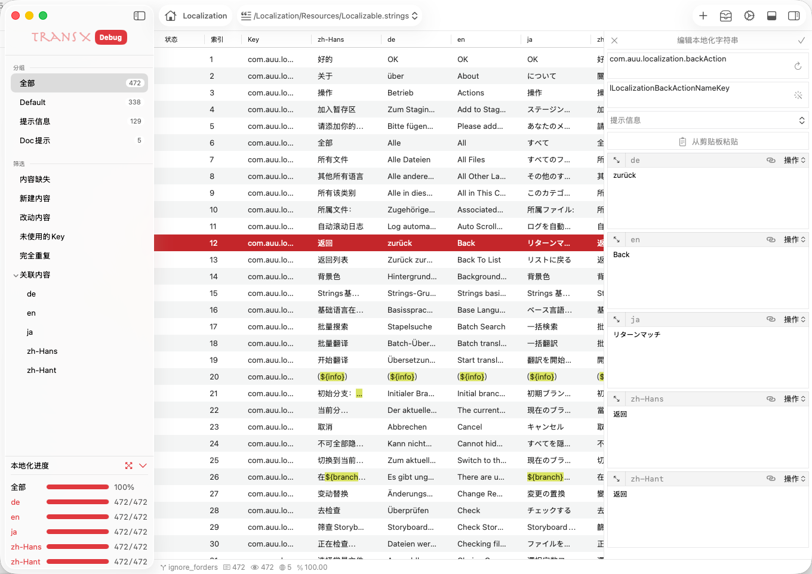

# 主窗口

主窗口是 TransX 的核心工作区域，承载了多语言内容管理的全部功能。该窗口采用模块化设计，将不同功能区域清晰划分，形成高效的工作流程。

整个主窗口由七个功能区域组成，每个区域都专注于特定的任务，相互配合形成完整的本地化管理工作流：

## 功能区域概览

### [控制区](./03_main/01_control.md)
位于窗口顶部的命令中心，提供全局级别的操作控制。包含项目管理、文件操作、同步、导入导出等核心功能的快捷访问入口。控制区的设计遵循"常用操作一键触达"的原则，让您无需频繁切换菜单即可完成大部分操作。

### [导航区](./03_main/02_navigation.md)
项目结构的可视化导航面板，展示当前项目中所有的 `.strings` 文件及其组织结构。支持快速切换不同的本地化文件，实时显示每个文件的条目统计和完成状态。通过导航区，您可以宏观把握整个项目的本地化进度。

### [内容区](./03_main/03_content.md)
多语言字符串的列表视图，这是您花费时间最多的工作区域。以表格形式展示选中文件的所有本地化条目，支持多种视图模式、强大的搜索过滤、批量操作等功能。内容区的设计注重效率，让您能够快速定位、编辑和管理大量的本地化内容。

### [编辑区](./03_main/04_editor.md)
专注的文本编辑环境，用于修改选中条目的具体内容。提供多语言并列编辑、实时预览、语法高亮等功能，确保翻译的准确性和一致性。编辑区支持快捷键操作，让编辑流程更加流畅。

### [预览区](./03_main/05_preview.md)
多语言内容的整体预览区域。当您在内容区批量选中多个字符串条目时，预览区会以列表方式集中展示所有相关文本，支持多语言对比、格式检查和批量审阅。该区域有助于快速核查翻译一致性、排版效果及内容完整性，尤其适合在导出前或团队协作审核时进行全局质量把控。

### [日志区](./03_main/06_log.md)
系统操作记录和状态反馈中心。实时记录 TransX 执行的所有操作，包括文件解析、内容变更、错误警告、性能统计等。日志区采用分级显示机制，让您既能快速查看关键信息，也能深入追踪详细的操作历史。

### [Dock 栏](./03_main/07_dock.md)
快速工具和状态栏，提供常用功能的快捷入口和项目状态的实时反馈。Dock 栏的设计考虑了空间效率和访问便利性的平衡，让重要信息和常用工具始终触手可及。

## 工作流程建议

1. **浏览定位**：通过导航区选择要处理的 `.strings` 文件
2. **筛选查找**：在内容区使用搜索和过滤功能定位目标条目
3. **编辑修改**：在编辑区进行翻译或文案调整
4. **实时预览**：通过预览区检查显示效果
5. **查看反馈**：在日志区确认操作执行状态
6. **持续管理**：使用控制区的功能进行批量操作或项目级管理

每个功能区域都有详细的专门文档，点击上方链接深入了解各区域的具体功能和使用技巧。