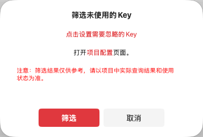
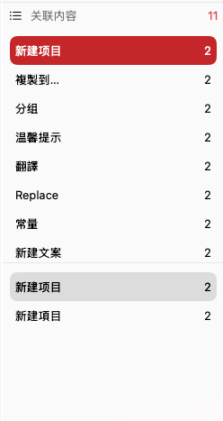
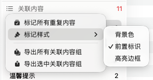
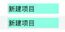
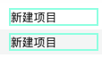

# 控制区


控制区位于主窗口左侧，是 TransX 多语言内容管理的核心导航区域。该区域以树形结构组织和展示项目中的所有本地化资源，提供了强大的分类、筛选和数据统计功能，帮助开发者高效管理 Xcode 项目中的 `.strings` 文件内容。

## 分组

### 功能概述

分组功能是 TransX 提供的多语言文案组织管理机制。在控制区顶部会以列表形式展示所有用户自定义的分组，每个分组项会实时显示该分组下包含的文案条目数量，便于快速评估各模块的本地化工作量。

### 使用场景

在大型 iOS/macOS 项目开发中，`.strings` 文件往往包含数百甚至上千条本地化字符串。合理的分组管理能够：

- **模块化管理**：按功能模块划分，便于团队协作时明确责任归属
- **快速定位**：在需要修改特定功能的文案时，可以快速缩小查找范围
- **版本迭代**：新版本功能的文案可以单独分组，便于统一检查和导出
- **质量控制**：针对特定分组进行集中审查，确保术语和风格的一致性

### 分组示例

根据不同的项目特点，可以采用多种分组策略：

**按功能模块分组：**
- 用户认证（登录、注册、密码找回）
- 交易系统（下单、支付、订单管理）
- 行情数据（K线、深度、实时报价）
- 个人中心（资料编辑、安全设置）

**按内容类型分组：**
- 提示信息（Toast、Alert 提示文本）
- 错误信息（网络错误、业务错误、系统错误）
- 按钮标签（确认、取消、提交等操作按钮）
- 占位文本（TextField placeholder）

**按业务场景分组：**
- 新手引导
- 活动运营
- 客服支持
- 法律条款

### 操作说明

1. 点击任意分组名称，内容区会自动筛选并显示该分组下的所有文案条目
2. 分组后的数字标识表示该分组包含的文案总数，帮助评估工作量
3. 可以在项目设置中创建、编辑或删除分组
4. 支持将文案在不同分组间移动，便于后期调整组织结构

## 筛选

### 功能概述

筛选功能是 TransX 的智能内容过滤系统，能够根据文案的不同状态和特征，快速定位需要处理的条目。在 Xcode 项目的本地化开发流程中，开发者经常需要处理各种特定场景的文案问题，筛选功能可以大幅提升问题定位和处理效率。

### 1. 内容缺失

**功能说明：**  
自动检测并显示所有存在内容缺失问题的多语言条目。缺失类型包括：
- 某个或多个目标语言的翻译文本为空
- 启用常量模式后，缺少对应的常量定义
- 部分语言的文案被意外删除

**使用场景：**
- **提交前检查**：在将代码推送到仓库前，统一检查是否有遗漏的翻译
- **App Store 提审**：确保所有支持的语言都有完整的本地化内容，避免审核被拒
- **质量保证**：防止因内容缺失导致的界面显示异常或崩溃问题

**操作建议：**
1. 在导出 `.strings` 文件前，先使用此筛选检查一遍
2. 按语言维度查看缺失情况，优先处理主要市场的语言
3. 对于暂时无法翻译的内容，可以先使用英文作为 fallback

### 2. 新建内容

**功能说明：**  
显示当前编辑会话中新创建的所有多语言文案条目。一旦用户执行导出操作，这些条目将从"新建内容"状态转为正常状态。

**使用场景：**
- **版本功能跟踪**：在开发新功能时，可以清晰看到本次新增了哪些文案
- **文案审核**：产品经理或本地化团队可以集中审查新增的所有文案
- **增量导出**：只导出新增的文案条目，避免全量导出造成的文件冲突

**工作流程：**
1. 开发阶段：随着功能开发，实时记录新建的文案条目
2. 审核阶段：使用此筛选统一查看、编辑新增文案
3. 导出阶段：确认无误后导出到本地 `.strings` 文件
4. 状态重置：导出后，条目从"新建"状态清除

### 3. 改动内容

**功能说明：**  
跟踪并显示在当前使用过程中被修改过的多语言条目。修改包括：
- 修改任何语言的翻译文本
- 更改 Key 值或常量名
- 调整分组归属

**使用场景：**
- **变更追踪**：在多人协作时，了解哪些文案被修改过
- **版本对比**：对比不同版本间的文案差异
- **回归测试**：修改文案后，需要对相关界面进行回归测试
- **提交说明**：生成详细的 commit message，记录本次修改的文案范围

**注意事项：**
- 导出到本地后，改动状态会被清除
- 建议在导出前截图或导出改动列表，便于后续追溯
- 如果使用 Git 管理，可以配合 diff 工具查看具体变更

### 4. 未使用的 Key



**功能说明：**  
通过扫描项目源代码，检测在代码中未被引用的本地化字符串 Key。这个功能会分析 `.swift`、`.m`、`.mm` 等源代码文件，查找 `NSLocalizedString` 或类似的本地化调用。

**使用场景：**
- **代码清理**：删除废弃功能后遗留的无用文案，减少维护成本
- **性能优化**：减少 `.strings` 文件体积，降低 App 包大小
- **质量提升**：避免过时的文案造成混淆
- **审计检查**：定期清理无用资源，保持项目整洁

**使用流程：**
1. 点击"未使用的 Key"筛选选项
2. 在弹出的页面中设置筛选参数
3. TransX 会扫描指定的代码目录
4. 分析结果显示在内容区，标注未被引用的 Key
5. 人工审核确认（某些 Key 可能通过字符串拼接方式使用）
6. 批量删除或移至回收站

**注意事项：**
> ⚠️ 此筛选结果仅供参考，实际项目中可能存在：
> - 动态字符串拼接：`NSLocalizedString("error_\(code)", comment: "")`
> - OC 运行时调用：通过 `performSelector` 等方式间接调用
> - 服务端配置：某些 Key 值由服务端下发
> - 第三方库引用：被依赖的 framework 使用
> 
> 删除前请务必进行人工确认和测试！

### 5. 完全重复

**功能说明：**  
智能检测所有多语言条目中，所有语言的翻译文本都完全相同的情况。例如：

```
// 条目 A
Key: "button.submit"
en: "Submit"
zh-Hans: "提交"

// 条目 B
Key: "button.confirm"  
en: "Submit"
zh-Hans: "提交"

// 以上两条会被识别为完全重复
```

**使用场景：**
- **资源优化**：合并重复文案，减少翻译和维护成本
- **统一管理**：相同含义的文案使用同一个 Key，保证一致性
- **重构整理**：清理历史遗留的重复定义
- **术语统一**：确保同一概念在不同界面使用相同的表述

**操作建议：**
1. 审查重复文案的使用场景，确认是否真的可以合并
2. 选择保留语义更清晰的 Key 值
3. 使用"查找引用"功能，确认代码中的使用情况
4. 在代码中批量替换 Key 值后，再删除多余的条目
5. 建立命名规范，从源头减少重复创建

### 6. 关联内容

**功能说明：**  
关联内容筛选采用蛛网式算法，以多语言文案为关联节点进行深度查找。只要任意语言的文本内容相同，即被认定为关联项，并通过传递性扩展关联范围。

**算法示例：**
```
条目 A: en="hello"     zh-Hans="你好"
条目 B: en="hi"        zh-Hans="你好"  
条目 C: en="hi"        zh-Hans="嗨"
条目 D: en="greeting"  zh-Hans="嗨"

关联链：
A ←→ B (通过 zh-Hans 关联)
B ←→ C (通过 en 关联)
C ←→ D (通过 zh-Hans 关联)

结果：A、B、C、D 四个条目被识别为一个关联组
```

**使用场景：**
- **术语统一**：发现不同 Key 使用了相同的翻译文本
- **翻译复用**：为相似条目提供翻译参考
- **质量审查**：检查是否存在翻译不一致的情况
- **本地化优化**：评估是否可以合并相似的文案条目

**高级选项：**
- **全语言比对**：检查所有语言的关联关系（默认模式）
- **单语言比对**：仅基于某个特定语言（如中文）进行关联分析
- **设置阈值**：可以设定最小关联度，过滤弱关联关系

**实际应用案例：**  
在一个金融交易应用中，发现以下关联组：
```
"trade.buy.button" → "买入"
"order.buy.action" → "买入"  
"market.buy.title" → "买入"
```
通过关联内容分析，团队决定统一使用 `"action.buy"` 作为标准 Key，并在代码中进行重构，最终减少了 30% 的重复文案。

## 关联内容详情



### 显示条件

只有在执行"关联内容"筛选后，控制区才会展开显示关联内容详情面板。该面板会列出所有检测到的关联内容组，并提供详细的统计信息和操作选项。

### 统计信息

每个关联内容组会显示该组包含的文案条目总数。

### 可视化标记



为了更直观地展示关联关系，TransX 提供了多种可视化标记方案，可通过左上角菜单访问：

#### 1. 标记所有重复内容

**选中状态：**  
在多语言文案列表中，会将关联组内所有相同的文案条目都进行标记，无论当前是否选中。这样可以一眼看出整个关联网络的全貌，便于全局分析。

**未选中状态：**  
仅对当前选中的关联文案组进行标记，方便聚焦于特定条目的关联关系，避免信息过载。

**使用建议：**
- 初次分析时，开启"标记所有"获取全局视图
- 深入分析特定条目时，关闭以聚焦当前项

#### 2. 标记样式

**背景色模式：**  

- 为关联组内的条目设置相同的背景颜色
- 不同关联组使用不同颜色区分
- 适合查看大量数据时的快速识别
- 支持自定义颜色方案

**前置标识模式：**  

- 在每个条目的 Key 前添加特殊标识符
- 相同关联组使用相同颜色
- 不影响原有的界面布局

**高亮边框模式：**  

- 为关联条目添加彩色边框
- 保持内容区域清晰，不遮挡文本
- 可以与其他模式组合使用

#### 3. 导出选项

**全部导出：**
- 导出所有检测到的关联内容组
- 生成完整的关联分析报告
- 适合团队共享和存档

**导出格式支持：**
- CSV (.csv)：便于导入其他工具分析
- Markdown (.md)：生成可读性强的文档报告

**当前组导出：**
- 仅导出当前选中的关联内容组
- 快速生成针对性报告
- 适合向特定负责人汇报某个模块的问题

**导出内容示例：**
```markdown
# 关联内容组 #3

## 基本信息
- 条目数量: 5
- 关联度: 85%
- 涉及语言: zh-Hans, en

## 详细列表
| Key | en | zh-Hans | 分组 |
|-----|----|----|------|
| error.network.timeout | Request timeout | 请求超时 | 错误信息 |
| alert.timeout | Request timeout | 请求超时 | 提示信息 |
...
```

## 本地化进度

### 功能概述

本地化进度区域提供了项目整体和各语言维度的翻译完成度统计，帮助项目管理者实时掌握本地化工作进展。

### 显示内容

**各语言进度：**
- 每种支持的语言单独显示一行
- 显示格式：`语言名称 进度条 已翻译数/总数`
- 示例：`简体中文 +++++++--- 856/1024`

### 交互功能

**打开本地文件：**
1. 点击任意语言名称
2. 系统会在 Finder 中打开对应的 `.strings` 文件所在目录
3. 便于直接查看或手动编辑原始文件

**展开/收起：**
- 点击右上角的箭头图标
- 展开：显示所有语言的详细进度
- 收起：仅显示整体进度，节省屏幕空间

### 使用场景

**项目管理：**
- 每日站会汇报本地化进度
- 评估距离发布还需要多少翻译工作
- 识别进度落后的语言，分配更多资源

**质量保证：**
- 确保每个语言都达到 100% 完成度再提审
- 对低于阈值的语言进行重点审查

**多语言优先级：**
- 优先完成主要市场语言（如中文、英文）
- 次要市场语言可以分批发布

### 计算规则

```
单语言完成度 = (已填写内容的条目数 / 该语言总条目数) × 100%

整体完成度 = Σ(各语言完成度) / 支持的语言总数
```