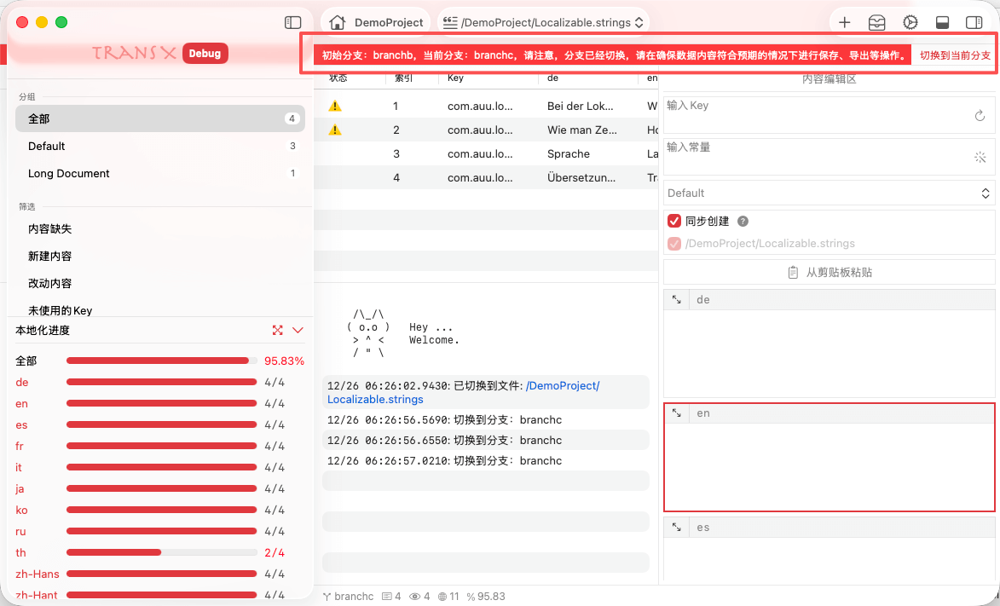

# 分支管理



## 功能概述

分支管理是 TransX 中用于监控和管理 Git 版本控制系统下项目分支状态的核心功能。该功能通过实时检测项目所在 Git 分支的变化，确保 TransX 编辑环境与当前 Xcode 项目分支保持一致性，有效防止因外部分支切换导致的本地化内容混乱、数据覆盖和版本冲突等问题。

对于使用 Git 进行版本管理的多分支开发流程，此功能是保障本地化内容完整性和团队协作效率的重要机制。

## 工作原理

### 自动分支检测机制

**初始化检测**：  
当 TransX 启动并加载 Xcode 项目时，系统会立即执行以下操作：
- 自动识别项目是否使用 Git 版本控制
- 读取项目根目录的 `.git` 配置信息
- 检测并记录当前项目所在的 Git 分支名称
- 将分支信息存储到内部状态管理器中

**动态监控机制**：  
在应用运行期间，TransX 实现了智能的分支状态监控：
- 每当应用窗口重新获得焦点（从后台切回前台）时自动触发检测
- 执行 Git 命令查询当前项目的实际分支状态
- 将检测到的分支与内部记录的分支进行对比
- 整个检测过程在后台异步执行，不会阻塞用户界面操作

### 分支不一致警告

当检测到 Xcode 项目在 TransX 外部被切换到不同分支时，系统会立即采取以下保护措施：

**视觉警告机制**：
- 在内容区顶部显示醒目的**红色警告条幅**
- 警告条幅会清晰指出当前项目所在分支与 TransX 记录的分支不匹配
- 条幅会持续显示，直到问题被解决或用户手动处理

**警告信息内容**：
- **记录的分支**：TransX 内部记录的原始分支名称
- **当前分支**：项目实际所在的 Git 分支名称
- **操作建议**：提示用户可采取的解决方案

**保护机制的价值**：

此机制可以有效防止以下常见问题：

1. **内容错配风险**
   - 在错误的分支上编辑本地化文件
   - 导致将一个分支的翻译内容误保存到另一个分支

2. **数据覆盖风险**
   - 不同分支的 .strings 文件内容可能存在差异
   - 在错误分支编辑后保存，可能覆盖该分支的原有内容
   - 造成难以追溯的数据丢失

3. **版本冲突风险**
   - 团队协作时，多人在不同分支工作
   - 误操作可能导致分支合并时产生大量冲突
   - 增加版本管理的复杂度和错误率

4. **工作流混乱**
   - 开发人员在 feature 分支工作，却在 main 分支编辑了本地化
   - 导致提交记录混乱，难以进行代码审查

**工作流保护示例**：

```
场景：开发人员正在 feature/new-login 分支工作

1. TransX 记录分支：feature/new-login
2. 开发人员在终端切换到 main 分支：git checkout main
3. 开发人员切回 TransX 窗口（窗口获得焦点）
4. TransX 自动检测到分支变化
5. 立即显示红色警告："项目已从 feature/new-login 切换到 main"
6. 开发人员意识到错误，可以选择：
   - 在终端切回 feature/new-login 分支
   - 或在 TransX 中点击"切换到当前分支"同步到 main
```

### 分支恢复提示

当用户将 Xcode 项目切换回 TransX 记录的原始分支时：

**自动恢复机制**：
- 红色警告条幅会**自动消失**
- 表明分支状态已恢复一致
- 用户可以安全地继续编辑工作

**状态同步**：
- TransX 会再次验证当前分支与内部记录的一致性
- 确认文件状态与当前分支匹配
- 恢复正常的编辑模式

## 操作步骤

### 切换到当前分支

当确认需要在新分支上工作时，可以通过以下步骤将 TransX 的工作环境同步到新分支：

**操作流程**：

1. **识别警告**：
   - 观察内容区顶部的红色警告条幅
   - 确认当前项目所在分支与需求是否匹配
   - 决定是切回原分支还是同步到新分支

2. **确认意图**：
   - 如果新分支是正确的工作目标，继续下一步
   - 如果是误切换，建议在终端或 Git 工具中切回原分支
   - **重要**：确认当前工作已保存，切换分支会重新加载文件

3. **执行切换**：
   - 点击红色警告条幅右侧的"切换到当前分支"按钮
   - 系统会弹出二次确认对话框，提示可能的影响
   - 确认后，TransX 开始执行分支切换流程

4. **系统处理**：
   - **重新扫描**：TransX 重新扫描当前 Xcode 项目的资源文件结构
   - **文件加载**：重新加载新分支下的所有 .strings 文件内容
   - **状态更新**：更新内部分支记录，与新分支保持同步
   - **缓存清理**：清除旧分支相关的缓存数据
   - **界面刷新**：刷新内容列表，显示新分支的本地化条目

5. **验证结果**：
   - 警告条幅消失，表示切换成功
   - 内容列表显示新分支的实际内容
   - 可以正常进行编辑和保存操作

**数据影响说明**：

⚠️ **重要提示**：执行"切换到当前分支"操作会产生以下影响：

- **未保存内容丢失**：所有未保存的编辑内容将会丢失，无法恢复
- **视图重置**：当前的筛选、搜索、排序状态会被重置
- **文件结构变化**：新分支可能包含不同的 .strings 文件
- **内容差异**：相同 Key 在不同分支可能有不同的翻译内容

**操作前检查清单**：

✅ 在执行切换前，请确认：
- [ ] 当前所有修改已保存（`Command + S`）
- [ ] 确认新分支是正确的工作目标
- [ ] 了解新分支与旧分支的内容差异
- [ ] 如有必要，已备份或提交当前工作
- [ ] 确认网络连接正常（如果项目在远程）

**最佳实践**：

1. **养成保存习惯**：频繁保存工作，减少切换时的数据丢失风险
2. **分支工作隔离**：尽量避免在工作中途频繁切换分支
3. **使用版本控制**：定期提交本地化文件到 Git，便于恢复和追溯
4. **团队沟通**：在切换分支前，与团队确认当前分支的工作状态

## 使用场景

### 多分支开发

在进行 feature 分支开发、hotfix 修复或版本维护时，不同分支可能有不同的本地化需求：

- **主分支（main/master）**：包含稳定的生产环境翻译
- **开发分支（develop）**：包含正在开发的新功能文案
- **功能分支（feature/*）**：可能包含实验性或特定功能的本地化内容
- **修复分支（hotfix/*）**：针对紧急问题的文案修正

### 团队协作

在团队环境中，多人可能同时在不同分支上工作，分支管理功能可以：

- 确保每个成员在正确的分支上编辑对应的本地化文件
- 避免分支合并时产生不必要的冲突
- 保持各分支本地化内容的独立性和完整性

## 注意事项

1. **Git 依赖**：此功能仅在项目使用 Git 进行版本控制时可用，非 Git 项目不会显示分支相关信息
2. **外部切换**：TransX 只能检测到在外部（如终端、SourceTree、Xcode 等）进行的分支切换，无法主动切换分支
3. **保存建议**：在看到分支不一致警告时，建议先保存当前工作，再决定是否切换到新分支
4. **重新加载**：切换到新分支后，所有未保存的编辑内容将会丢失，请务必提前保存
5. **文件差异**：不同分支可能包含不同的 .strings 文件，切换分支后可用的本地化文件列表可能会发生变化