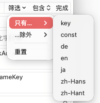

# 搜索与替换


## 功能概述

搜索与替换是 TransX 中最核心的内容编辑工具之一，为本地化工作提供专业级的文本查找和批量处理能力。该功能支持多维度的搜索条件、多种文本匹配模式（包括正则表达式）以及精确的搜索范围控制，能够显著提升本地化内容的编辑效率和质量管理水平。

无论是快速定位特定条目、统一修改术语翻译，还是进行复杂的文本模式匹配，搜索与替换功能都能提供高效、精准的解决方案。

## 快捷键操作

### 搜索模式

- **快捷键**：`Command + F`
- **功能**：激活搜索模式，在内容列表中快速查找指定的文本内容
- **应用场景**：查找特定的 Key 值、定位某个翻译文案、检查术语使用情况

### 搜索替换模式

- **快捷键**：`Command + Shift + F`
- **功能**：激活搜索替换模式，可以批量替换匹配的文本内容
- **应用场景**：统一修改术语翻译、更正拼写错误、批量调整文案格式

## 匹配模式

TransX 提供了专业的多维度匹配系统，充分考虑 .strings 文件的结构化特性和本地化工作的实际需求：

### 本地化文案信息匹配



针对 .strings 文件的结构化数据提供专门的匹配维度：

**1. Key 匹配**：在本地化键名中进行搜索
- 适用于查找特定功能模块的所有条目（如 `com.app.login.*`）
- 定位需要重构或重命名的 Key
- 查找遵循特定命名规范的条目

**2. 常量匹配**：在自动生成的常量名称中进行搜索
- 开发人员可以通过常量名快速定位对应的本地化条目
- 验证常量命名是否符合代码规范
- 在代码和本地化内容之间建立快速查找通道

**3. 语言内容匹配**：在具体的翻译文本中进行搜索
- **单一语言搜索**：仅在指定语言的翻译中查找（如只在中文翻译中搜索"登录"）
- **所有语言搜索**：在项目配置的所有语言翻译中查找匹配项
- **基础语言搜索**：仅在项目设定的基础语言中搜索
- 适用于术语统一、错误修正、翻译审核等场景

### 常规内容匹配模式


提供标准的文本搜索选项，支持精确控制匹配规则：

**1. 大小写敏感（Case Sensitive）**
- 功能：区分英文字母的大小写进行精确匹配
- 示例：搜索"Login"不会匹配到"login"或"LOGIN"
- 应用场景：
  - 查找严格遵循命名规范的标识符
  - 区分专有名词和普通词汇
  - 审查大小写使用的一致性

**2. 全词匹配（Whole Word）**
- 功能：仅匹配完整的单词，不匹配单词的一部分
- 示例：搜索"app"不会匹配到"application"或"happily"
- 应用场景：
  - 避免部分匹配导致的误报
  - 精确查找特定的术语或关键词
  - 确保搜索结果的相关性

**3. 正则表达式（Regular Expression）**
- 功能：使用正则表达式进行高级模式匹配
- 支持标准的正则语法（如 `^`、`$`、`.*`、`\d`、`[a-z]` 等）
- 应用场景：
  - 查找符合特定模式的内容（如所有数字、特定格式的日期）
  - 复杂的条件搜索（如"以...开头且包含...的条目"）
  - 批量查找有规律的内容

**正则表达式应用示例**：
```regex
^com\.app\.login\..*        # 查找所有以 com.app.login. 开头的 Key
\d{4}-\d{2}-\d{2}          # 查找日期格式 YYYY-MM-DD
[点击|按下|选择].*按钮       # 查找包含特定动作词和"按钮"的文本
^[A-Z].*[。！？]$            # 查找以大写字母开头、中文标点结尾的句子
```

## 操作步骤

### 基础搜索流程

1. **激活搜索模式**：
   - 按下 `Command + F` 快捷键
   - 或通过菜单"编辑 > 查找"打开搜索框
   - 搜索框会出现在内容区顶部或底部

2. **输入搜索内容**：
   - 在搜索输入框中输入要查找的文本
   - 支持实时搜索，输入时即开始匹配
   - 可以看到匹配结果的实时高亮显示

3. **配置匹配条件**：
   - **选择搜索范围**：Key、常量、注释、特定语言或所有语言
   - **设置匹配模式**：大小写敏感、全词匹配、正则表达式
   - 配置会被系统记忆，下次搜索时保持

4. **执行搜索**：
   - 按 `Enter` 键开始搜索
   - 或点击搜索框右侧的搜索按钮
   - 系统会显示所有匹配条目，并对匹配内容高亮显示

5. **浏览搜索结果**：
   - 使用上下箭头按钮在结果间跳转
   - 或使用快捷键：
     - `Command + G`：跳转到下一个结果
     - `Command + Shift + G`：跳转到上一个结果
   - 当前匹配项会高亮显示，并自动滚动到可见区域

7. **退出搜索模式**：
   - 按 `Esc` 键退出
   - 或点击搜索框的关闭按钮
   - 搜索高亮会被清除，恢复正常显示

### 批量替换流程

1. **激活搜索替换模式**：
   - 按下 `Command + Shift + F` 快捷键
   - 或通过菜单"编辑 > 查找和替换"
   - 界面会显示搜索框和替换框两个输入区域

2. **输入搜索和替换内容**：
   - **搜索框**：输入要查找的文本或正则表达式模式
   - **替换框**：输入替换后的新文本
   - 支持正则表达式捕获组替换（如 `$1`、`$2`）

3. **配置匹配和替换选项**：
   - 选择搜索范围（Key、特定语言、所有语言等）
   - 设置匹配模式（大小写敏感、全词匹配、正则表达式）
   - 预览第一个匹配结果

4. **验证替换结果**：
   - 随机抽查几个被替换的条目，确认替换正确
   - 被替换的条目会被标记为已修改状态

5. **保存更改**：
   - 确认替换结果无误后，使用 `Command + S` 保存
   - 或通过菜单"文件 > 保存"

**替换操作安全建议**：

⚠️ **重要提示**：
- 批量替换是不可逆的操作（除非及时撤销），请谨慎使用
- 对于正则表达式替换，务必先充分测试模式的正确性
- 在关键操作前，建议先提交版本控制或备份文件

## 使用场景

### 术语统一

在本地化过程中，保持术语翻译的一致性是质量保证的重要环节。

**场景示例**：

1. **统一产品术语**
   - 将所有"用户名"统一改为"账号"
   - 修正不一致的产品名称拼写（如"AppName" vs "App Name"）
   - 统一技术术语的翻译（如"同步" vs "同步化"）

2. **品牌名称规范**
   - 确保公司名称、产品名称在所有语言中的一致性
   - 统一商标符号的使用（™、®、©）
   - 规范品牌相关词汇的大小写

3. **界面元素统一**
   - 统一按钮文案风格（如"确定" vs "确认" vs "OK"）
   - 调整标题文本的格式（如首字母大写规则）
   - 统一日期时间格式的表达方式

**操作示例**：
```
搜索：用户名
替换：账号
范围：所有语言的内容
结果：将项目中所有语言的"用户名"统一替换为"账号"
```

### 错误修正

快速发现并修正批量出现的错误，提升内容质量。

**常见错误类型**：

1. **拼写错误**
   - 英文单词拼写错误（如"recieve" → "receive"）
   - 中文错别字（如"帐号" → "账号"）
   - 术语拼写不规范

2. **标点符号错误**
   - 中文标点与英文标点混用
   - 句末标点缺失或错误
   - 引号使用不规范（""、''、""）

3. **格式问题**
   - 多余的空格或制表符
   - 错误的换行符
   - 不统一的数字格式

4. **语法问题**
   - 时态错误
   - 单复数不当
   - 性别代词不一致

**操作示例**：
```
场景：发现所有中文翻译都误用了英文句号
搜索：\.$（使用正则表达式）
替换：。
范围：仅中文语言
结果：将所有中文句末的英文句号替换为中文句号
```

### Key 值重构

在代码重构或项目重组时，可能需要调整本地化 Key 的命名规范。

**重构场景**：

1. **修改前缀**
   - 从 `app.` 改为 `com.company.app.`
   - 添加模块前缀以支持模块化架构

2. **统一命名风格**
   - 从 `user_name` 改为 `userName`（统一为驼峰命名）
   - 从 `BTN_OK` 改为 `button.ok`（统一为点分隔）

3. **调整层级结构**
   - 重新组织 Key 的模块划分
   - 调整功能分组

**操作示例**：
```
场景：为所有 Key 添加公司前缀
搜索：^app\.（使用正则表达式，匹配以 app. 开头的 Key）
替换：com.company.app.
范围：Key 列
结果：app.login.title → com.company.app.login.title
```

**注意事项**：
⚠️ 修改 Key 值后，需要同步更新代码中的引用，建议：
- 先在版本控制中提交当前状态
- 导出修改前后的 Key 对照表
- 使用 IDE 的全局搜索替换更新代码引用
- 进行完整的功能测试

### 内容审查

使用搜索功能进行全面的内容质量检查。

**审查维度**：

1. **长度检查**
   - 查找过长的翻译文案（可能导致 UI 溢出）
   - 搜索模式：`.{100,}`（查找超过 100 字符的内容）

2. **特殊字符检查**
   - 查找包含 HTML 标签的条目
   - 检索包含特殊控制字符的内容
   - 查找意外的转义字符

3. **缺失翻译检查**
   - 搜索空白内容的语言项
   - 查找仍然显示 Key 值作为翻译的条目
   - 识别仅包含占位符的翻译

4. **一致性检查**
   - 查找相同英文对应不同中文翻译的情况
   - 检查数字、日期格式的一致性
   - 验证链接和变量占位符的完整性

**操作示例**：
```
场景：查找可能导致 UI 问题的过长翻译
搜索：.{50,}（使用正则表达式）
范围：所有语言
操作：逐个检查匹配结果，评估是否需要精简
```

### 变量和占位符管理

查找和管理翻译文本中的变量占位符，确保格式正确。

**常见占位符格式**：
- `%@`、`%d`、`%s`（Objective-C / Swift）
- `{0}`、`{1}`、`{name}`（.NET / Android）
- `$variable`、`${variable}`（各种模板引擎）

**检查项目**：
- 占位符数量是否与原文一致
- 占位符顺序是否正确
- 占位符格式是否符合规范

**操作示例**：
```
场景：查找包含占位符的条目，检查翻译是否保留了占位符
搜索：%[a-zA-Z@]（使用正则表达式，匹配 % 开头的占位符）
范围：所有语言
操作：确认每个翻译都正确保留了占位符
```

## 注意事项

1. **替换不可逆性**
   - 批量替换操作在保存后无法自动撤销
   - 确认无误后再考虑使用"替换"
   - 重要操作前先提交版本控制或创建备份

2. **正则表达式验证**
   - 使用正则表达式时请仔细测试模式的准确性
   - 避免过于宽泛的模式导致误匹配
   - 建议先在小范围测试正则表达式效果
   - 熟悉基本的正则语法和转义规则

3. **语言范围选择**
   - 在多语言项目中，注意选择正确的搜索范围
   - 避免在错误的语言中进行替换操作
   - 某些操作可能只适用于特定语言（如标点符号统一）

4. **Key 值替换风险**
   - 替换 Key 值时要特别谨慎
   - Key 值是代码中引用的标识符
   - 修改后需要同步更新代码，否则会导致运行时错误
   - 建议先在测试分支进行 Key 重构

5. **保存提醒**
   - 搜索替换操作会将内容标记为已修改状态
   - 记得及时保存更改（`Command + S`）

6. **性能考虑**
   - 在包含数千条记录的大型项目中
   - 使用复杂正则表达式进行全文搜索可能需要较长时间
   - 请耐心等待搜索完成，避免中断操作

7. **搜索结果数量**
   - 如果搜索结果过多（如数百个匹配）
   - 考虑缩小搜索范围或使用更精确的搜索条件
   - 过多的结果可能影响操作效率和准确性

8. **大小写和空格**
   - 注意搜索内容中的大小写和空格
   - 多余的空格可能导致搜索失败
   - 使用"大小写敏感"选项控制匹配精度

9. **特殊字符转义**
   - 在正则表达式中，某些字符需要转义（如 `.`、`*`、`?`、`+`）
   - 搜索这些字符本身时，需要使用反斜杠（`\`）
   - 示例：搜索句号用 `\.`，搜索问号用 `\?`

10. **历史记录**
    - TransX 会保存最近的搜索历史
    - 可以快速访问之前使用过的搜索条件
    - 定期清理搜索历史以保持整洁

