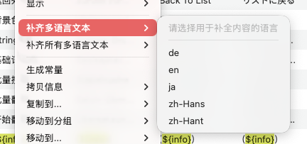

# 补齐多语言文本

## 功能概述

补齐多语言文本是 TransX 提供的智能批量填充工具，专门用于处理本地化项目中常见的翻译缺失问题。该功能通过选择一种已完成翻译的源语言，将其内容自动复制到其他缺失翻译的目标语言中，实现快速的内容填充。

此功能特别适用于以下场景：
- **项目初期**：开发阶段大量条目等待翻译，需要临时内容支持功能测试
- **新增语言**：向现有项目添加新语言支持，需要过渡期的可用内容
- **紧急发布**：在截止日期前快速生成各语言的可运行版本
- **翻译基准**：为翻译团队提供参考文本，帮助理解上下文语境

通过使用补齐功能，可以确保应用在所有配置的语言环境下都有可显示的内容，避免界面出现空白、占位符或 Key 值，同时为后续的专业翻译工作建立参考基准。

## 功能选项

### 1. 补齐多语言文本

**作用范围**：对当前选中的一条或多条本地化条目进行精确的内容补齐操作。

**操作流程**：
1. **选择目标条目**：
   - 在内容列表中选择需要补齐的条目
   - 支持单选、多选（`Command + 点击`）或范围选择（`Shift + 点击`）
   - 可以先使用筛选功能定位到缺失翻译的条目

2. **打开功能菜单**：
   - 在选中的条目上右键点击
   - 找到并选择"补齐多语言文本"菜单项

3. **选择源语言**：
   - 系统会弹出语言选择对话框
   - 列表中显示项目中所有已配置的语言
   - 选择一种翻译内容较完整的语言作为源
   - 建议优先选择基础语言或完成度最高的语言

4. **执行补齐**：
   - 点击确认按钮后，系统开始处理
   - 将源语言的文本内容复制到其他缺失翻译的目标语言中
   - 仅填充空白或缺失的翻译，已有内容不会被覆盖

5. **验证结果**：
   - 补齐完成后，相关条目会被标记为已修改状态
   - 可以逐个检查补齐后的内容

**适用场景**：
- **精确控制**：只需要对特定的几条新增内容进行快速补齐
- **测试验证**：先对小范围条目进行补齐测试，确认效果后再大规模操作
- **关键内容优先**：优先处理高频使用或关键功能的本地化条目
- **审慎操作**：对每组条目单独处理，避免误操作影响范围过大

**优势**：
- 补齐范围可控，不会影响未选中的条目
- 可以在操作前预览选中的条目，确保目标正确
- 适合逐步补齐、分阶段处理的工作流程

### 2. 补齐所有多语言文本

**作用范围**：对当前列表视图中显示的所有本地化条目进行批量补齐操作。

**操作流程**：
1. **准备工作**：
   - 确认当前列表显示的是需要补齐的条目
   - 如果只需补齐特定分组，先在导航区选择该分组
   - 如果只需补齐符合特定条件的内容，先使用筛选或搜索功能

2. **触发批量操作**：
   - 在内容列表区域的空白处右键点击（无需选择具体条目）
   - 选择"补齐所有多语言文本"菜单项

3. **选择源语言**：
   - 在弹出的对话框中选择用作源文本的语言
   - 系统会在日志区显示影响的条目

4. **查看结果统计**：
   - 操作完成后，显示详细的统计信息
   - 例如："已处理 156 个条目，补齐了 423 个缺失翻译"
   - 所有被修改的条目会被标记为待保存状态

5. **保存更改**：
   - 使用 `Command + E` 或"文件 > 导出"保存所有更改
   - 建议在保存前抽查几条，确认补齐效果符合预期

**适用场景**：
- **项目初期**：大量条目处于未翻译状态，需要快速填充所有内容
- **新增语言**：向现有项目添加新语言支持，需要批量生成初始内容
- **紧急发布**：在截止日期前快速生成所有语言的可用版本
- **整体预处理**：为翻译团队批量生成参考文本基线

**重要提示**：
- **受筛选影响**：此操作只处理当前列表中可见的条目，不可见的条目不会被处理
- **不可撤销**：批量操作一旦执行并保存，无法一键撤销，建议操作前先提交版本控制或备份

**优势**：
- 一次性处理所有符合条件的条目，效率极高
- 适合项目级别的批量初始化工作
- 配合筛选功能可以灵活控制处理范围

## 补齐逻辑说明

### 源语言选择

在执行补齐操作时，需要选择一个源语言，其文本内容将被复制到其他语言中。推荐的选择策略：

1. **基础语言优先**：通常选择项目的基础语言（如中文或英文）
2. **完整性考虑**：选择翻译最完整的语言作为源
3. **相关性原则**：如果补齐日语，可以考虑使用中文作为源（文化相近）

### 缺失判断规则

系统会将以下情况视为"翻译缺失"并进行补齐：

- 该语言的文本字段为空（empty string）
- 该语言的文本字段仅包含空白字符（空格、制表符、换行符等）

### 补齐策略

- **非破坏性**：已有的翻译内容不会被覆盖，只填充空白项
- **逐条处理**：每个条目独立处理，不会因某条失败而影响其他条目
- **状态标记**：补齐后的条目会被标记为已修改，提醒用户需要保存

## 使用场景详解

### 场景 1：开发初期快速填充

**背景**：
项目刚刚开始国际化，开发人员创建了 100 条中文 Key 和文案，但其他 5 种语言（英语、日语、德语、法语、西班牙语）都还没有翻译。

**问题**：
- 运行应用时，非中文环境下界面显示空白或 Key 值
- 无法进行完整的 UI 测试
- 翻译团队还需要 1-2 周才能完成工作

**解决方案**：
1. 选择"补齐所有多语言文本"
2. 选择中文作为源语言
3. 所有其他语言都会临时填充中文文本
4. 应用在所有语言环境下都能显示（虽然显示的是中文）
5. UI 布局和功能可以正常测试
6. 翻译完成后，再逐步替换为正确的翻译

**优势**：
- 避免界面空白，提升用户体验
- 为翻译人员提供上下文参考
- 不阻塞开发和测试进度

### 场景 2：新增语言支持

**背景**：
应用原本支持英语、简体中文、繁体中文、日语，现在需要新增韩语支持。

**问题**：
- 现有 800 条本地化条目
- 韩语翻译需要外包，需要 1 个月时间
- 运营团队希望先上线韩语版本，即使显示英文也比没有好

**解决方案**：
1. 在项目中添加韩语（ko）配置
2. 使用"补齐所有多语言文本"
3. 选择英语作为源语言
4. 韩语版本临时显示英文内容
5. 逐步收到翻译后，替换为正确的韩语翻译

**优势**：
- 快速上线韩语版本，满足运营需求
- 翻译可以在线上版本的基础上进行，有真实场景参考
- 支持渐进式翻译，不需要一次性完成

### 场景 3：遗漏条目的快速处理

**背景**：
在开发过程中，开发人员添加了 5 条新的功能文案，但忘记通知翻译团队，只填写了英文。

**问题**：
- 应用已经接近发布日期
- 5 条文案涉及新功能的关键提示
- 其他语言用户会看到空白或英文，影响体验

**解决方案**：
1. 选中这 5 条缺失翻译的条目
2. 使用"补齐多语言文本"
3. 选择英文作为源语言
4. 先让所有语言临时显示英文
5. 发布后通知翻译团队补充翻译
6. 在下个版本更新为正确的翻译

### 场景 4：测试环境快速准备

**背景**：
QA 团队需要测试所有语言环境下的应用表现，但部分语言的翻译还未完成。

**问题**：
- 缺失翻译导致界面错乱
- 无法完整测试 UI 布局
- 无法验证文本长度对界面的影响

**解决方案**：
1. 创建一个测试分支
2. 使用补齐功能，用英文填充所有缺失内容
3. QA 可以在完整的文本环境下测试
4. 测试完成后丢弃此分支，不影响主分支

## 操作步骤详解

### 选中条目补齐操作

1. **选择条目**：
   - 单击选中一条
   - 按住 `Command` 键多选不连续的条目
   - 按住 `Shift` 键选中连续的多条
   - 使用 `Command + A` 全选

2. **打开菜单**：
   - 在选中区域右键点击
   - 找到"补齐多语言文本"选项

3. **选择源语言**：
   - 在弹出的对话框中查看可用的源语言列表
   - 选择翻译最完整的语言
   - 点击"确定"按钮

4. **确认结果**：
   - 查看补齐结果提示
   - 检查被修改的条目是否符合预期
   - 保存修改

### 全部补齐操作

1. **准备工作**：
   - 如果只需要补齐特定分组，先在导航区选择该分组
   - 如果需要补齐特定条件的内容，先使用筛选功能

2. **执行补齐**：
   - 在列表区域空白处右键
   - 选择"补齐所有多语言文本"
   - 在确认对话框中查看将要处理的条目数量
   - 选择源语言并确认

3. **验证结果**：
   - 查看统计信息（处理了多少条目，补齐了多少个翻译）
   - 滚动列表随机抽查几条，确认补齐正确
   - 使用筛选功能检查是否还有缺失的内容

4. **保存更改**：
   - 按 `Command + S` 保存
   - 或使用菜单"文件 > 保存"

## 注意事项

1. **临时方案**：补齐功能是临时解决方案，不能替代专业翻译，应尽快安排正确的翻译
2. **不可逆性**：虽然补齐操作本身不会覆盖已有内容，但保存后无法自动区分哪些是补齐的，哪些是人工翻译的
3. **文化差异**：直接复制文本可能导致文化不适配，如中文成语直接显示在英文界面中
4. **UI 适配**：不同语言的文本长度差异很大，补齐后应测试 UI 布局是否正常
5. **版本管理**：建议在执行大规模补齐前先提交当前更改，便于回退
6. **标记缺失**：考虑为补齐的内容添加特殊标记（如添加 `[Pending]` 前缀），便于后续识别和替换
7. **筛选影响**：注意当前的筛选和搜索状态，"补齐所有"只会处理可见的条目
8. **权限管理**：在团队协作中，应明确哪些成员有权限执行批量补齐操作
9. **通知机制**：执行补齐后应及时通知翻译团队，避免重复工作
10. **质量检查**：补齐后的内容仍需要经过翻译和审核流程，确保最终质量

    