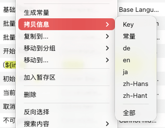

# 拷贝信息



## 功能概述

拷贝信息功能提供了灵活的数据导出方式，允许用户将选中条目的本地化数据以多种格式复制到系统剪贴板。该功能支持精确控制导出的数据维度（Key、常量、特定语言、所有语言等），便于在文档编写、代码开发、团队沟通和数据分析等场景中快速获取和分享本地化内容。

## 可复制的内容类型

### 1. Key 列表

**说明**：仅复制选中条目的 Key 值，每行一个，不包含翻译内容。

**应用场景**：
- 在代码中快速查找这些 Key 的使用位置
- 生成需要翻译的 Key 清单提供给翻译团队
- 在文档或邮件中列举需要讨论的条目
- 作为脚本处理的输入数据

**输出格式示例**：
```
com.auu.localization.backAction
com.auu.localization.backToList
com.auu.localization.backgroundColor
com.auu.localization.baseLanguage
com.auu.localization.baseLanguageFirst
```

### 2. 常量列表

**说明**：复制选中条目对应的常量名称，基于偏好设置中配置的常量生成规则。

**应用场景**：
- 在代码中引用本地化字符串时快速获取常量名
- 生成常量定义文件的内容片段
- 检查常量命名是否符合规范
- 在代码审查中讨论常量使用

**输出格式示例**：
```
kBackAction
kBackToList
kBackgroundColor
kBaseLanguage
kBaseLanguageFirst
```

### 3. 特定语言内容

**说明**：复制选中条目在某一种特定语言中的翻译文本。

**应用场景**：
- 将某语言的翻译内容提供给审核人员
- 在文档中引用实际的界面文案
- 对比不同版本间某语言的翻译变化
- 导出到翻译记忆库或 CAT 工具

**输出格式示例**（中文）：
```
返回
返回列表
背景色
Strings基础语言
基础语言在第一列
```

### 4. 完整信息（所有语言）

**说明**：复制选中条目的 Key 及其在所有配置语言中的翻译，采用缩进结构清晰展示。

**应用场景**：
- 在团队讨论中完整展示某条目的所有翻译
- 生成本地化内容的文档或报告
- 审核多语言翻译的一致性和质量
- 作为翻译参考资料分享

**输出格式示例**：
```
com.auu.localization.backAction
	de: zurück
	en: Back
	ja: リターンマッチ
	zh-Hans: 返回
	zh-Hant: 返回
com.auu.localization.backToList
	de: Zurück zur Liste
	en: Back To List
	ja: リストに戻る
	zh-Hans: 返回列表
	zh-Hant: 返回列表
com.auu.localization.backgroundColor
	de: Hintergrundfarbe
	en: Background Color
	ja: 背景色
	zh-Hans: 背景色
	zh-Hant: 背景色
com.auu.localization.baseLanguage
	de: Strings-Grundsprache
	en: Strings basic language
	ja: Strings 基本言語
	zh-Hans: Strings基础语言
	zh-Hant: Strings基礎語言
com.auu.localization.baseLanguageFirst
	de: Basissprache in der ersten Spalte anzeigen
	en: Base Language First
	ja: ベース言語を最初の列に表示
	zh-Hans: 基础语言在第一列
	zh-Hant: 基礎語言顯示在第一欄
```

## 操作步骤

### 基本操作流程

1. **选择条目**：
   - 在内容列表中选中一条或多条需要复制的本地化条目
   - 支持使用 `Command + 点击` 进行多选
   - 支持使用 `Shift + 点击` 选择连续范围
   - 可以使用 `Command + A` 全选所有条目

2. **打开菜单**：
   - 在选中区域右键点击
   - 找到"拷贝"或"复制信息"子菜单

3. **选择复制类型**：
   - 根据需求选择要复制的内容类型（Key、常量、特定语言、全部信息等）
   - 对于特定语言，可能需要在子菜单中选择具体的语言

4. **使用数据**：
   - 复制完成后，数据已保存到系统剪贴板
   - 可以在任何支持文本粘贴的应用中使用 `Command + V` 粘贴

## 使用场景详解

### 场景 1：生成常量定义文件

**背景**：开发人员需要创建或更新常量定义文件，包含所有本地化 Key 的常量。

**操作流程**：
1. 在 TransX 中全选所有条目（`Command + A`）
2. 右键选择"拷贝 > 常量列表"
3. 打开代码编辑器，创建 `LocalizationKeys.swift` 文件
4. 粘贴复制的常量列表
5. 根据需要添加常量值定义和注释

### 场景 2：翻译审核文档

**背景**：需要将某些条目的多语言翻译发送给审核人员或客户确认。

**操作流程**：
1. 筛选或搜索出需要审核的条目
2. 选中这些条目
3. 右键选择"拷贝 > 全部信息"
4. 在邮件或文档中粘贴，附上审核说明

### 场景 3：文档撰写

**背景**：编写产品文档或用户手册时，需要引用应用中的实际界面文案。

**操作流程**：
1. 在 TransX 中找到相关的界面文案条目
2. 选择需要引用的条目
3. 右键选择"拷贝 > 特定语言"（如中文）
4. 在文档中粘贴引用

### 场景 4：代码搜索和重构

**背景**：需要在代码库中查找所有使用了某些本地化 Key 的地方。

**操作流程**：
1. 在 TransX 中选择相关条目
2. 复制 Key 列表
3. 在 IDE 中使用全局搜索功能
4. 批量搜索这些 Key 的使用情况

## 注意事项

1. **格式保持**：复制的内容保持结构化格式，粘贴到纯文本编辑器中效果最佳
2. **大量数据**：复制大量条目时，生成的文本可能较长，注意目标应用的处理能力
3. **字符编码**：确保粘贴目标支持 UTF-8 编码，以正确显示多语言字符
4. **换行符**：不同系统的换行符可能不同，必要时需要转换（Windows 使用 CRLF，macOS/Linux 使用 LF）
5. **常量规则**：复制常量时，确保偏好设置中的常量生成规则已正确配置
6. **隐藏内容**：如果某些语言列被隐藏（如在单语言模式下），复制"全部信息"仍会包含所有语言
7. **空白处理**：缺失翻译的语言在复制时可能显示为空白或占位符
8. **特殊字符**：注意转义字符（如 `\n`、`\t`）在不同上下文中的表示方式

## 最佳实践

1. **选择性复制**：根据实际需求选择最合适的复制类型，避免信息过载
2. **验证内容**：复制后在粘贴前，建议先在文本编辑器中预览确认格式正确
3. **批量处理**：对于大量条目，考虑分批复制和处理，避免一次性操作过多数据
4. **二次加工**：复制的纯文本数据可以通过脚本进一步处理，生成所需格式
5. **文档记录**：在团队协作中，建议记录复制数据的来源和时间，便于追溯
6. **隐私保护**：复制包含敏感信息的本地化内容时，注意数据安全和隐私保护