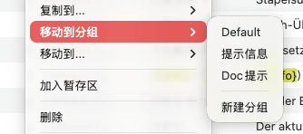

# 移动到分组



## 功能概述

移动到分组功能用于在同一 .strings 文件内,将本地化条目在不同分组之间进行转移,帮助用户按照功能模块、使用场景或其他逻辑关系重新组织和管理本地化内容。该功能是实现本地化内容结构化管理的核心工具,特别适合项目重构、内容整理和模块化管理场景。

## 分组的概念与作用

在 TransX 中，分组（Group）是组织本地化内容的逻辑单元，类似于文件系统中的文件夹：

**组织维度**：
- **按功能模块**：登录模块、首页模块、设置模块、个人中心等
- **按界面结构**：TabBar、导航栏、对话框、弹出提示等
- **按内容类型**：按钮文案、标题文案、错误提示、帮助说明等
- **按开发阶段**：MVP 功能、二期功能、实验性功能等

**管理优势**：
- **快速定位**：通过分组快速找到相关的本地化内容
- **批量操作**：可以对整个分组进行批量编辑、导出等操作
- **职责分配**：不同分组可以分配给不同的翻译人员
- **版本管理**：便于追踪某个模块的本地化变更历史
- **逻辑清晰**：帮助团队成员理解项目的本地化结构

## 工作原理

### 分组存储方式

分组信息通常存储在 .strings 文件中，使用特殊格式的注释标记分组
```objc
// --------------------------------------------------
// --------------------------------------------------
// MARK: - 提示信息
// --------------------------------------------------
// --------------------------------------------------

// 所属文件：
"com.auu.localization.associatedFile" = "所属文件：";

// 返回
"com.auu.localization.backAction" = "返回";

// 初始分支：${initialBranch}，当前分支：${currentBranch}，请注意，分支已经切换，请在确保数据内容符合预期的情况下进行保存、导出等操作。
"com.auu.localization.branchChangedTips" = "初始分支：${initialBranch}，当前分支：${currentBranch}，请注意，分支已经切换，请在确保数据内容符合预期的情况下进行保存、导出等操作。";

// 当前分支为：${branch}
"com.auu.localization.branchIs" = "当前分支为：${branch}";
```

**TransX 不记录元数据文件中的分组信息，完全以strings文件内的内容为主**

### 移动操作的效果

移动到分组操作会：
1. 从源分组中移除选中的条目
2. 将条目添加到目标分组中
3. 更新 .strings 文件中的分组标记
4. **保持 Key 值和所有翻译内容不变**

## 操作步骤

### 基础移动流程

1. **选择条目**：
   - 在内容列表中选中需要移动的一条或多条本地化条目
   - 可以使用 `Command + 点击` 多选不连续的条目
   - 使用 `Shift + 点击` 选择连续的多条

2. **打开菜单**：
   - 在选中的条目上右键点击
   - 找到"移动到分组"菜单项

3. **选择目标分组**：
   - 在子菜单中显示当前文件的所有分组列表
   - 选择目标分组
   - 如果需要，可以先创建新分组

4. **确认移动**：
   - 点击目标分组名称
   - 选中的条目会立即移动到目标分组
   - 如果选中的条目所在分组跟目标分组相同，那么会自动的跳过移动操作
   - 当前视图会更新，移动的条目从当前分组消失（除非在"全部"视图中）

5. **验证结果**：
   - 在导航区选择目标分组
   - 确认条目已成功移动到新分组
   - 检查条目的内容和翻译是否完整

### 创建新分组并移动

如果目标分组还不存在：

**方法一**：先创建后移动
1. 先在导航区创建新分组（通常通过右键菜单或添加按钮）
2. 然后使用"移动到分组"功能将条目移动过去

**方法二**：移动时创建
1. 在"移动到分组"菜单中选择"新建分组..."选项
2. 输入新分组的名称
3. 确认后，选中的条目会被移动到新创建的分组中

## 使用场景详解

### 场景 1：项目初期分组整理

**背景**：
项目开发初期，所有本地化条目都创建在默认分组中，随着条目增多（达到几百条），需要按功能模块进行整理。

**操作流程**：
1. 规划分组结构（如：登录、注册、首页、商品、订单、设置、个人中心等）
2. 在导航区创建各个功能模块的分组
3. 在内容列表中使用搜索功能，输入"login"找到登录模块的所有条目
4. 全选这些搜索结果
5. 右键选择"移动到分组 > 登录"
6. 重复以上步骤，整理其他模块的条目

**效果**：
- 本地化内容按功能模块清晰组织
- 便于后续的维护和扩展
- 团队成员可以快速定位需要的内容
- 代码审查时更容易理解各模块的本地化情况

### 场景 2：新功能开发中的分组调整

**背景**：
开发新功能时，先在"开发中"或"临时"分组创建本地化条目，功能稳定后需要移动到正式的功能分组。

**操作流程**：
1. 在"开发中"分组下创建新功能的所有本地化条目
2. 进行开发、翻译和测试
3. 功能开发完成并测试通过后
4. 选中该功能的所有条目
5. 移动到对应的正式功能分组（如"用户中心"）
6. 清空或删除"开发中"分组

**优势**：
- 避免未完成的功能文案混入正式分组
- 便于识别哪些是实验性或临时的内容
- 功能确认后再正式归档

### 场景 3：错误分组的纠正

**背景**：
开发人员或翻译人员不小心在错误的分组下创建或编辑了本地化条目。

**问题示例**：
- 登录页面的文案误创建在"设置"分组下
- 错误提示文案创建在"按钮"分组下
- 新功能的文案放在了老版本的分组中

**解决方案**：
1. 在错误的分组中找到误放的条目
2. 选中这些条目
3. 使用"移动到分组"功能移到正确的分组
4. 验证移动成功

### 场景 4：按翻译状态临时组织

**背景**：
项目准备发布，需要清楚哪些内容还未翻译完成，便于集中处理。

**操作流程**：
1. 创建"待翻译"临时分组
2. 使用筛选功能找出所有缺失翻译的条目
3. 将这些条目临时移动到"待翻译"分组
4. 分配给翻译团队集中处理
5. 翻译完成后，再移回原来的功能分组
6. 删除"待翻译"临时分组

**优势**：
- 集中展示需要处理的内容
- 便于分配翻译任务
- 便于追踪翻译进度

### 场景 5：重构中的内容重组

**背景**：
应用进行架构重构，模块职责发生变化，本地化内容也需要重新组织。

**示例**：
原来的"用户中心"分组拆分为"账号管理"和"个人资料"两个独立分组。

**操作流程**：
1. 创建"账号管理"和"个人资料"两个新分组
2. 在"用户中心"分组中，识别哪些条目属于账号管理
3. 选中这些条目，移动到"账号管理"分组
4. 将剩余的个人资料相关条目移动到"个人资料"分组
5. 验证移动完成后，删除旧的"用户中心"分组

## 批量移动技巧

### 使用搜索结果批量移动

**适用场景**：需要移动的条目分散在不同位置，但有共同特征

**操作方法**：
1. 使用搜索功能找到需要移动的条目（如搜索 Key 中包含 "error" 的所有条目）
2. 在搜索结果中全选或多选
3. 执行移动操作
4. 所有选中的搜索结果会被移动到目标分组

### 使用筛选条件批量移动

**适用场景**：按特定条件（如缺失翻译、最近修改、新创建等）批量移动

**操作方法**：
1. 应用筛选条件
2. 在筛选结果中选择需要移动的条目
3. 批量移动到目标分组

### 使用暂存区批量移动

**适用场景**：需要从多个分组收集特定条目，然后统一移动

**操作方法**：
1. 从不同分组将需要移动的条目逐个或批量加入暂存区
2. 在暂存区中全选所有条目
3. 统一移动到目标分组
4. 暂存区会自动清空已移动的条目

## 分组管理最佳实践

### 分组命名规范

**清晰明确的命名**：
- ✅ 好的命名：`登录与注册`、`首页-推荐`、`错误提示`、`通用按钮`
- ❌ 不好的命名：`组1`、`临时`、`其他`、`Test`

**使用编号前缀**（可选）：
对于复杂项目，可以使用编号前缀便于排序：
```
├── 01-应用启动
├── 02-登录注册
├── 03-首页
├── 04-商品浏览
├── 05-购物车
├── 06-订单管理
├── 07-个人中心
├── 08-设置
├── 90-通用组件
└── 99-错误与提示
```

### 分组结构设计

**按功能模块划分**（最推荐）：

```
├── 用户认证-登录
├── 用户认证-注册
├── 用户认证-找回密码
├── 主功能-首页
├── 主功能-搜索
├── 主功能-详情页
├── 交易流程-购物车
├── 交易流程-下单
├── 交易流程-支付
├── 用户管理-个人资料
├── 用户管理-订单记录
└── 用户管理-设置
```

**按界面结构划分**：
```
├── 导航与TabBar
├── 主界面
├── 弹窗对话框
├── 侧边栏
└── 底部工具栏
```

### 分组维护策略

1. **定期整理**：每个迭代或版本发布前整理分组结构
2. **文档同步**：在项目文档或 README 中说明分组组织方式
3. **命名一致**：分组命名尽量与代码中的模块名称、文件夹名称保持一致
4. **避免过细**：不要创建过多的细分组，一般 10-20 个主分组较为合适
5. **动态调整**：随着项目发展，适时调整分组结构以适应新需求
6. **及时归档**：废弃的功能文案移到"已废弃"分组，而不是直接删除

## 注意事项

1. **Key 值不变**：移动到分组操作只改变条目的组织方式，不会修改 Key 值或翻译内容
2. **分组唯一性**：一个条目在同一时间只能属于一个分组
3. **移动不可逆**：移动操作没有专门的撤销功能，需要手动移回原分组（但可以通过版本控制回退）
4. **保存提醒**：移动操作会修改文件，记得及时保存
5. **全部视图**：在"全部"分组视图中，可以看到所有分组的条目，移动后条目不会消失
6. **文件范围**：移动到分组只能在同一 .strings 文件内进行，跨文件移动需使用"移动到..."功能
7. **分组删除影响**：如果删除一个分组，其中的条目通常会移到默认分组或提示用户处理
8. **代码无影响**：分组信息通常不影响代码中的本地化字符串引用（Key 值未变）
9. **导出可能受影响**：某些导出选项可能按分组导出，移动分组会影响导出结果的组织形式
10. **团队协作**：在团队环境中，分组调整应与团队成员同步，避免造成混乱

## 团队协作建议

### 分组规范制定

在项目初期制定分组规范：
- 定义分组的划分维度（功能、界面、类型等）
- 规定分组命名规则
- 明确谁有权限创建和调整分组
- 文档化分组结构和用途

### 变更通知机制

当进行大规模分组调整时：
1. 提前在团队会议或沟通群中通知
2. 说明调整的原因和影响范围
3. 提供新的分组结构文档
4. 给团队成员适应时间
5. 提交代码时在 commit message 中说明分组调整

### 权限管理

- 核心分组结构由项目负责人或架构师维护
- 开发人员可以在规定范围内创建临时分组
- 定期审查和清理不必要的临时分组
- 重要的分组调整需要评审

## 与其他功能的配合使用

### 配合搜索功能

先搜索定位条目，再批量移动到合适的分组，提高重组效率。

### 配合筛选功能

使用筛选条件（如"缺失翻译"、"最近编辑"等）找出需要重新组织的条目。

### 配合导出功能

按分组导出本地化内容，便于分配翻译任务或生成模块化文档。

### 配合暂存区功能

从多个位置收集条目到暂存区，再统一移动到目标分组。
