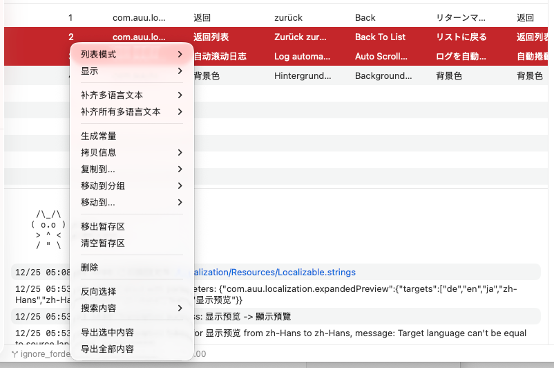

# 加入暂存区

## 功能概述

暂存区（Stash）是 TransX 提供的临时工作区域,用于收集和暂存需要集中处理的本地化条目。类似于购物车或剪贴板的增强版,暂存区允许用户从列表的不同位置、不同分组、不同搜索结果中逐步收集条目,然后在暂存区中统一进行批量操作,如导出、删除、移动分组、批量编辑等。暂存区是提高批量操作效率的关键工具,特别适合需要跨越多个视图收集特定条目的复杂工作流程。

## 核心特性

### 临时性

暂存区的内容是临时的，具有以下特点：

- **文件作用域**：暂存区仅对当前选中的 .strings 文件有效
- **会话保持**：在同一文件内，暂存区内容会保持，直到主动清除
- **文件切换重置**：在导航区切换到不同的 .strings 文件时，暂存区会被自动清空
- **不持久化**：暂存区内容不会被保存到磁盘，关闭项目后会丢失

### 集中管理

暂存区提供独立的视图和操作界面：

- **独立视图**：在内容区底部或侧边显示暂存区面板
- **计数显示**：实时显示暂存区中的条目数量
- **完整功能**：支持与主列表类似的右键菜单操作

## 暂存区操作

### 加入暂存区

**方法一：右键菜单**
1. 在主列表中选中一条或多条本地化条目
2. 右键点击选中的条目
3. 选择"加入暂存区"菜单项
4. 选中的条目会被添加到暂存区
5. 暂存区面板会显示或更新

**方法二：快捷键**
- 选中条目后，使用快捷键（如 `Command + B`）快速加入暂存区

**方法三：拖拽**
- 将选中的条目拖拽到暂存区面板

### 查看暂存区

**显示暂存区面板**：
- 暂存区有内容时会自动显示
- 暂存区通常显示在内容区底部

**暂存区视图**：
- 显示所有已加入的条目
- 每个条目显示 Key、部分翻译内容等基本信息
- 可以查看条目数量统计

### 暂存区中的操作

暂存区支持的右键菜单功能与主列表类似，包括但不限于：

**内容编辑**：
- 编辑翻译内容
- 生成常量
- 补齐多语言文本

**信息操作**：
- 拷贝信息（Key、常量、指定语言、全部）
- 查看详细信息

**组织管理**：
- 移动到分组
- 移动到其他文件

**批量处理**：
- 导出选中或全部
- 删除选中或全部
- **移出暂存区**：将选中的条目从暂存区移除（不删除条目本身）

**清空操作**：
- **清空暂存区**：一键清空所有暂存的条目
- 清空后暂存区面板会自动隐藏

## 使用场景详解

### 场景 1：多次搜索的累积结果

**背景**：
需要导出所有包含"错误"、"失败"、"异常"等关键词的提示文案，但这些条目分散在不同位置，需要多次搜索。

**传统方式的问题**：
- 每次搜索只能看到当前搜索的结果
- 无法累积多次搜索的结果
- 如果每次搜索后都导出，会生成多个文件，不便管理

**使用暂存区的解决方案**：
1. 第一次搜索：搜索"错误"
2. 在搜索结果中选中相关条目，加入暂存区
3. 第二次搜索：搜索"失败"
4. 在新的搜索结果中选中相关条目，继续加入暂存区
5. 第三次搜索：搜索"异常"
6. 继续加入暂存区
7. 在暂存区中全选所有累积的条目
8. 一次性导出所有错误相关的文案

**优势**：
- 累积多次搜索的结果
- 统一管理和操作
- 减少重复劳动
- 导出结果更完整

### 场景 2：跨分组收集特定条目

**背景**：
项目经理需要将各个功能模块中涉及"支付"的文案导出，交给财务部门审核。这些文案分散在"订单"、"购物车"、"会员中心"等多个分组中。

**操作流程**：
1. 在"订单"分组中，筛选或搜索包含"支付"的条目
2. 选中相关条目，加入暂存区
3. 切换到"购物车"分组，重复上述操作
4. 切换到"会员中心"分组，继续收集
5. 切换到其他相关分组，继续收集
6. 在暂存区中查看累积的所有支付相关条目
7. 全选并导出为一个完整的文档

**说明**：
虽然切换分组时主列表会变化，但暂存区的内容会保持，因此可以跨分组收集。

### 场景 3：标记待处理的问题条目

**背景**：
翻译审核过程中，发现了一些有问题的翻译，需要集中修改，但这些条目分散在整个文件的不同位置。

**操作流程**：
1. 审核过程中，发现问题条目时，将其加入暂存区
2. 继续审核，不断将有问题的条目加入暂存区
3. 审核完一轮后，在暂存区中查看所有问题条目
4. 逐个或批量修正这些问题
5. 修正完成后，从暂存区中移除已处理的条目
6. 或直接清空暂存区

**优势**：
- 审核和修改分离，提高效率
- 不会遗漏问题条目
- 可以集中精力处理问题

### 场景 4：筛选结果的二次筛选

**背景**：
使用筛选功能找到了"缺失翻译"的条目（假设有 50 条），但其中只有部分（比如 15 条）是紧急的，需要优先处理。

**操作流程**：
1. 应用"缺失翻译"筛选条件，显示 50 条结果
2. 浏览这 50 条，将紧急的 15 条加入暂存区
3. 在暂存区中专注于这 15 条，进行补齐翻译
4. 完成后从暂存区移除或清空
5. 再返回主列表处理剩余的 35 条

**优势**：
- 在筛选结果基础上进一步精选
- 实现多级筛选和分批处理
- 灵活的工作流程

### 场景 5：准备分配翻译任务

**背景**：
需要将一批新增的条目分配给外部翻译团队，但这批条目是在过去一周陆续创建的，需要从整个文件中收集出来。

**操作流程**：
1. 使用筛选功能：筛选"最近7天创建"
2. 浏览筛选结果，将需要翻译的条目加入暂存区
3. 排除不需要外部翻译的条目（如测试数据）
4. 在暂存区中确认最终的翻译任务清单
5. 导出暂存区内容，发送给翻译团队

### 场景 6：对比分析特定条目

**背景**：
需要对比分析某个设计师负责的所有界面的按钮文案，看是否有不一致的地方。

**操作流程**：
1. 搜索或浏览，找到第一个界面的按钮文案，加入暂存区
2. 继续寻找其他界面的按钮文案，陆续加入暂存区
3. 在暂存区中集中查看所有按钮文案
4. 进行一致性分析和调整
5. 调整完成后清空暂存区

## 注意事项

### 作用域限制

1. **文件级别**：
   - 暂存区只对当前 .strings 文件有效
   - 切换到不同的 .strings 文件，暂存区会被清空并重新开始
   - 无法跨文件收集条目到同一个暂存区

2. **示例说明**：
   - 在 `Localizable.strings` 中将 5 条加入暂存区
   - 切换到 `Widget.strings` 文件
   - 暂存区会被清空（之前的 5 条消失）
   - 可以在 `Widget.strings` 中重新收集条目到暂存区
   - 切回 `Localizable.strings` 时，暂存区又会重置

### 临时性特点

1. **不持久化**：
   - 暂存区内容不会保存到磁盘
   - 关闭项目后，暂存区内容会丢失
   - 应用崩溃或强制退出，暂存区内容会丢失

2. **建议操作**：
   - 将暂存区视为临时工作区
   - 完成批量操作后及时清空
   - 如果需要长期保存某些条目的集合，考虑使用分组功能
   - 重要的暂存内容建议先导出保存

### 与其他功能的交互

1. **搜索和筛选**：
   - 在搜索或筛选结果中加入暂存区后
   - 即使取消搜索或筛选，暂存区的内容仍然保留
   - 这样可以累积不同搜索结果

2. **编辑操作**：
   - 在主列表中编辑暂存区中的条目
   - 暂存区中会实时更新
   - 反之亦然

3. **删除操作**：
   - 如果在主列表中删除了暂存区中的条目
   - 该条目会自动从暂存区移除
   - 避免暂存区中出现已删除的条目

## 最佳实践

### 工作流程设计

**收集阶段**：
- 明确收集目标（要导出什么、要处理什么）
- 使用搜索、筛选等工具快速定位候选条目
- 逐批加入暂存区，而不是一次性全部加入
- 定期检查暂存区，确认收集是否正确

**处理阶段**：
- 在暂存区中统一进行批量操作
- 充分利用暂存区的右键菜单功能
- 对于大批量操作，先在少量条目上测试

**完成阶段**：
- 确认处理结果无误后，清空暂存区
- 如果还有未完成的，保留在暂存区继续处理
- 及时保存修改的内容

### 命名和标记

虽然 TransX 的暂存区本身不支持命名或标记，但可以采用以下策略：

**使用临时分组**：
- 对于需要长期跟踪的条目集合
- 考虑创建临时分组而非使用暂存区
- 如"待审核"、"本周新增"等临时分组

### 避免误操作

1. **清空前确认**：
   - 清空暂存区是不可逆的（无法撤销）
   - 清空前确认已完成所有必要的操作
   - 如果不确定，先导出暂存区内容作为备份

2. **切换文件前检查**：
   - 切换 .strings 文件会清空暂存区
   - 切换前检查暂存区是否还有未处理的内容
   - 必要时先完成暂存区的操作再切换

3. **批量操作谨慎**：
   - 对暂存区全选进行操作前，仔细确认
   - 特别是删除操作，避免误删

## 高级技巧

### 组合使用搜索和暂存区

**场景**：找出所有"错误"和"警告"提示，但排除"网络错误"

**操作**：
1. 搜索"错误"，将结果加入暂存区
2. 搜索"警告"，将结果加入暂存区
3. 搜索"网络错误"，在搜索结果中找到对应项
4. 从暂存区中移出这些"网络错误"项
5. 最终暂存区中是所有"错误"和"警告"但不包括"网络错误"

### 使用暂存区进行A/B对比

**场景**：对比两种翻译方案

**操作**：
1. 将方案 A 的条目加入暂存区
2. 导出暂存区内容，保存为"方案A.csv"
3. 清空暂存区
4. 将方案 B 的条目加入暂存区
5. 导出暂存区内容，保存为"方案B.csv"
6. 在外部工具中对比两个文件

### 暂存区与批量编辑结合

**场景**：需要对特定的一批条目进行相同的编辑操作

**操作**：
1. 将需要批量编辑的条目收集到暂存区
2. 在暂存区中全选
3. 使用批量操作功能（如补齐多语言、生成常量等）
4. 一次性处理所有条目
5. 验证结果后清空暂存区

## 与版本控制系统的配合

### Git工作流

虽然暂存区的名称与 Git 的 staging area 类似，但它们是不同的概念：

- **TransX 暂存区**：用于临时收集和批量处理本地化条目
- **Git 暂存区**：用于暂存即将提交的文件更改

### 配合使用

1. **功能开发**：使用 TransX 暂存区收集和处理本地化条目
2. **内容保存**：完成处理后，保存 .strings 文件
3. **版本控制**：将修改的 .strings 文件加入 Git 暂存区并提交

## 性能考虑

### 暂存区大小

- 暂存区可以容纳大量条目（通常支持数百到上千条）
- 过多条目可能影响暂存区视图的渲染性能
- 建议单次暂存的条目控制在合理范围内（如 <500条）

### 内存使用

- 暂存区内容保存在内存中
- 大量条目会占用一定内存
- 及时清空不再需要的暂存内容

## 未来可能的增强

虽然当前版本的暂存区功能已经很实用，但未来可能增加：

- **多个暂存区**：支持创建多个命名的暂存区
- **暂存区持久化**：可以保存暂存区的状态
- **跨文件暂存**：支持从多个 .strings 文件收集条目到统一暂存区
- **暂存区快照**：保存暂存区的快照，便于恢复
- **智能建议**：根据操作历史，智能建议可能需要暂存的条目