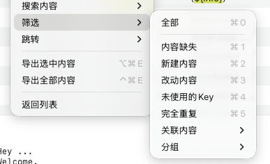

# 筛选

## 功能概述

筛选功能用于根据特定条件过滤和显示本地化条目,帮助用户快速定位符合特定状态、属性或规则的内容。筛选功能与左侧控制区的筛选面板完全联动,在内容区右键菜单中提供了快捷访问入口,使用户无需在控制区和内容区之间频繁切换即可应用筛选条件。筛选功能支持多条件组合（AND 逻辑）,是管理大型本地化项目、追踪翻译进度和执行质量检查的核心工具。

## 与控制区筛选的关系

内容区右键菜单中的"筛选"功能与左侧控制区的筛选面板是联动的：

- **相同的筛选条件**：两处提供完全相同的筛选选项
- **状态同步**：在任一处应用筛选，另一处的状态会同步更新
- **快捷访问**：右键菜单提供了不离开内容区即可操作筛选的便利
- **结果一致**：无论从哪里应用筛选，显示的结果都相同
