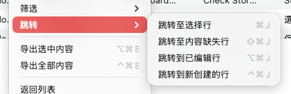

# 跳转



## 功能概述

跳转功能提供快速导航到特定类型条目的能力,是大型本地化项目中不可或缺的导航工具。在包含数百甚至数千条本地化条目的项目中,手动滚动查找特定状态的条目既耗时又容易遗漏。跳转功能可以自动定位并高亮显示符合条件的条目,支持循环遍历,让用户能够高效地逐个处理内容缺失、编辑修改或新创建的条目,大幅提高审核、验证和修正工作的效率。

## 跳转类型

### 1. 跳转至选中行

**功能说明**：
快速导航到当前选中的条目位置，特别适用于以下场景：

- **恢复视图位置**：在长列表中滚动到其他位置后，快速回到之前选中的条目
- **多选定位**：选中了多个分散的条目，快速跳转到第一个或最后一个选中项
- **跨页查看**：在大型项目中跨越多页内容后，回到选中的条目

**使用时机**：
- 选中了某个条目后，视图滚动到了其他位置
- 想快速查看选中条目的详细信息
- 在执行操作前确认选中的条目位置

**操作方法**：
1. 确保已选中一个或多个条目
2. 右键点击（可以在列表任意位置）
3. 选择"跳转 > 跳转至选中行"
4. 视图自动滚动到选中的条目，并居中显示

### 2. 跳转至内容缺失行

**功能说明**：
自动定位到下一个存在内容缺失的条目。内容缺失的定义包括：

- **常量缺失**：条目没有生成常量名称
- **翻译缺失**：至少有一种语言没有翻译内容

**使用时机**：
- 发布前检查内容完整性
- 修正翻译遗漏
- 规范化常量命名
- 质量审核

**操作方法**：
1. 右键选择"跳转 > 跳转至内容缺失行"
2. 视图自动跳转到第一个内容缺失的条目
3. 处理该条目的缺失问题
4. 再次执行跳转，定位到下一个缺失条目
5. 循环处理，直到所有缺失都被修正
6. 当没有更多缺失时，会提示"未找到内容缺失的条目"

**典型工作流**：
```
第1次跳转 → 修正缺失 → 第2次跳转 → 修正缺失 → ... → 全部完成
```

### 3. 跳转至已编辑行

**功能说明**：
依次跳转到当前会话中被编辑过但尚未保存的条目。

- **编辑标记**：TransX 会自动标记被修改的条目
- **未保存状态**：只跳转到修改后尚未保存的条目
- **依次遍历**：每次调用跳转到下一个已编辑的条目

**使用时机**：
- 保存前审核所有修改
- 检查编辑的内容是否正确
- 确认没有误修改
- 撤销不必要的更改

**操作方法**：
1. 在编辑会话中修改了多个条目
2. 想要逐一审核这些修改
3. 右键选择"跳转 > 跳转至已编辑行"
4. 自动跳转到第一个被编辑的条目
5. 审核该条目的修改
6. 如有问题，立即修正或撤销
7. 再次执行跳转，查看下一个编辑
8. 重复直到审核完所有编辑
9. 确认无误后保存文件

**应用场景**：
- **批量修改后验证**：执行了批量替换操作，逐个确认结果
- **多处编辑总结**：分散修改了多个地方，集中审核
- **误操作检查**：可能有误操作，快速定位所有修改点

### 4. 跳转至新创建行

**功能说明**：
依次跳转到当前会话中新创建的但尚未保存的条目。

- **新建标记**：TransX 自动标记新创建的条目
- **未保存状态**：只跳转到创建后尚未保存的条目
- **按创建顺序**：通常按创建时间顺序跳转

**使用时机**：
- 保存前审核新增内容
- 检查新创建条目的Key命名是否规范
- 确认翻译内容是否完整
- 验证常量生成是否正确

**操作方法**：
1. 在会话中创建了多个新条目
2. 想要逐一审核这些新内容
3. 右键选择"跳转 > 跳转至新创建行"
4. 自动跳转到第一个新创建的条目
5. 审核该条目的内容：
   - Key 命名是否合理
   - 翻译是否完整
   - 常量是否生成
   - 分组是否正确
6. 如有问题，立即修正
7. 再次执行跳转，查看下一个新建条目
8. 重复直到审核完所有新建内容
9. 确认无误后保存文件

**应用场景**：
- **批量创建后验证**：导入或批量添加了多个条目，逐个确认
- **开发阶段审核**：开发过程中临时创建了多个条目，集中审核
- **规范性检查**：确保新条目符合项目的本地化规范

## 操作步骤

### 单次跳转

1. **打开跳转菜单**：
   - 在内容列表区域右键点击
   - 找到"跳转"子菜单

2. **选择跳转类型**：
   - 根据需要选择跳转目标
   - 点击对应的菜单项

3. **查看跳转结果**：
   - 视图自动滚动到目标条目
   - 目标条目通常会高亮显示或居中
   - 可能会有动画效果指示跳转位置

### 循环跳转

对于"内容缺失"、"已编辑"、"新创建"这三种跳转：

1. **第一次跳转**：跳转到第一个符合条件的条目
2. **处理条目**：修正、审核或记录该条目
3. **第二次跳转**：再次执行相同的跳转命令，跳转到下一个
4. **继续循环**：重复步骤2-3
5. **完成提示**：当没有更多符合条件的条目时，显示提示信息

### 键盘快捷键（如果支持）

为了更高效的跳转操作，可能提供快捷键：

- **跳转至选中行**：`Command + J`
- **跳转至下一个缺失**：`Command + Shift + J`
- **跳转至下一个编辑**：`Command + Option + J`
- **跳转至下一个新建**：`Command + Control + J`

## 使用场景

### 场景 1：发布前的完整性检查

**背景**：
应用即将发布，需要确保所有新增和修改的本地化内容都没有缺失。

**操作流程**：
1. **检查新增内容**：
   - 使用"跳转至新创建行"
   - 逐个审核每个新建条目
   - 确认Key命名、翻译完整性、常量生成
   
2. **检查修改内容**：
   - 使用"跳转至已编辑行"
   - 逐个审核每个修改
   - 确认修改的合理性

3. **检查内容缺失**：
   - 使用"跳转至内容缺失行"
   - 修正所有缺失项
   - 直到没有更多缺失

4. **最终验证**：
   - 保存文件
   - 运行应用测试

### 场景 2：批量操作后的验证

**背景**：
使用"补齐多语言文本"功能批量填充了50个条目的翻译，需要随机抽查验证。

**操作流程**：
1. 执行批量补齐操作
2. 使用"跳转至已编辑行"
3. 跳转到第一个被修改的条目，检查补齐是否正确
4. 再次跳转，检查第二个
5. 随机跳过几个，再检查
6. 确认补齐逻辑正确后，保存

### 场景 3：增量开发的审核

**背景**：
本周开发了新功能，创建了20个新的本地化条目，周五需要审核这些新增内容。

**操作流程**：
1. 使用"跳转至新创建行"
2. 逐个审核新建的20个条目：
   - Key 命名是否符合规范
   - 是否在正确的分组中
   - 基础语言的文案是否准确
   - 其他语言是否需要翻译或可以复用
3. 发现问题立即修正
4. 审核完成后保存
5. 通知翻译团队进行翻译

### 场景 4：质量审核流程

**背景**：
QA 人员需要审核本次迭代的所有本地化变更。

**操作流程**：
1. **审核新增**：
   - 筛选"最近创建"（如最近30天）
   - 使用"跳转至新创建行"逐个审核
   - 或直接在筛选结果中逐个查看

2. **审核修改**：
   - 筛选"最近修改"
   - 使用"跳转至已编辑行"逐个审核
   - 确认修改的原因和合理性

3. **检查完整性**：
   - 使用"跳转至内容缺失行"
   - 确保没有缺失的翻译或常量

4. **生成审核报告**：
   - 导出审核过的内容
   - 标记发现的问题
   - 反馈给开发团队

### 场景 5：紧急修复的快速验证

**背景**：
发现某个翻译错误，紧急修改了几处，需要快速确认修改正确后立即发布。

**操作流程**：
1. 修改了3-4处错误的翻译
2. 使用"跳转至已编辑行"
3. 快速检查每一处修改
4. 确认都正确后立即保存
5. 提交代码并触发构建

## 注意事项

1. **跳转范围**：跳转功能通常在当前文件的当前分组或筛选结果中查找
2. **循环行为**：到达列表末尾后，会从头开始（循环）
3. **高亮显示**：跳转后的条目会短暂高亮，注意观察
4. **保存后清除**：保存文件后，"已编辑"和"新创建"标记会清除，相关跳转将无条目可跳
5. **筛选影响**：如果应用了筛选，跳转只在筛选结果中进行
6. **性能考虑**：在超大项目中，查找下一个目标条目可能需要短暂时间
7. **视觉跟踪**：快速连续跳转时，注意视觉跟踪，避免遗漏

## 最佳实践

### 建立审核清单

在使用跳转功能进行审核时，建立统一的审核标准：

**新建条目审核清单**：
- [ ] Key 命名符合规范（前缀、格式）
- [ ] 在正确的分组中
- [ ] 基础语言文案准确无误
- [ ] 需要翻译的语言已标记
- [ ] 常量已生成且命名正确

**编辑条目审核清单**：
- [ ] 修改有明确的原因
- [ ] 新翻译比旧翻译更准确
- [ ] 术语使用一致
- [ ] 没有引入拼写错误
- [ ] 保持格式和占位符正确

### 记录跳转进度

在长时间的审核过程中：

- 记录当前审核到第几个条目
- 如果中断，可以从记录位置继续
- 或使用暂存区标记已审核的条目

### 分批审核

对于大量需要审核的条目：

- 不要一次性审核完所有
- 分批次，每次审核一定数量（如20个）
- 避免疲劳导致审核质量下降

## 高级技巧

### 组合跳转和编辑

在跳转到目标条目后，可以立即：
- 单击条目进入编辑模式
- 修正问题
- 按相应快捷键跳到下一行
- 编辑完成后，再次跳转到下一个目标

### 跳转后的批量操作

跳转到一组特定条目后：
1. 可以选中当前条目
2. 继续跳转并按住 `Command` 多选
3. 累积选中多个目标条目
4. 对这些条目执行批量操作

### 配合暂存区标记

**工作流**：
1. 使用跳转功能遍历目标条目
2. 发现有问题的，加入暂存区
3. 继续跳转，继续标记
4. 最后在暂存区中集中处理问题条目

### 自动化脚本集成

对于高级用户，可以编写脚本：
- 自动检查内容缺失
- 生成缺失报告
- 自动修正简单问题
- 将复杂问题导出供人工审核

## 与其他功能的配合

### 跳转 + 筛选

先筛选，再跳转，精确定位

### 跳转 + 暂存区

跳转标记问题，暂存区集中处理

### 跳转 + 导出

跳转查看，确认后导出特定条目

### 跳转 + 搜索

搜索结果中使用跳转快速浏览

