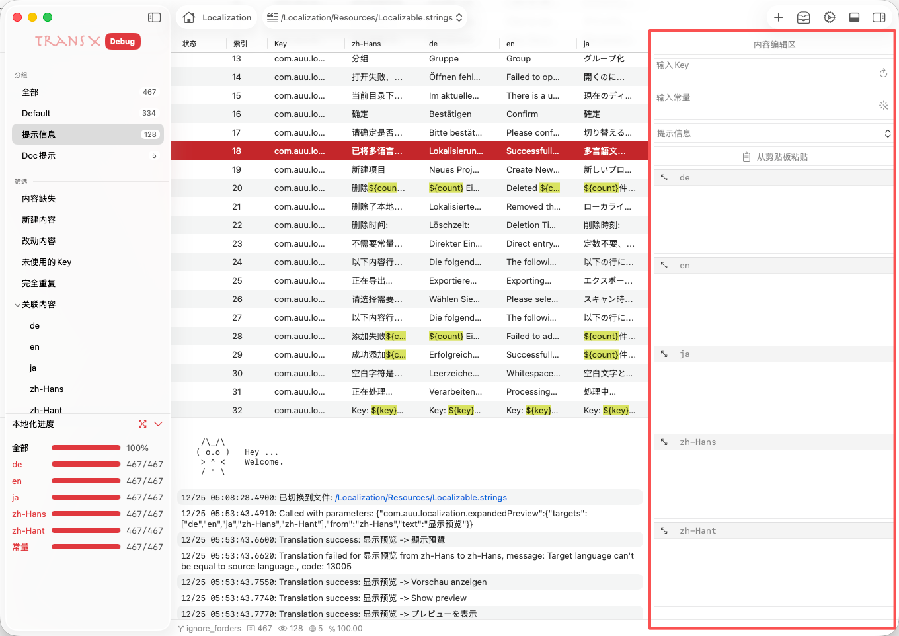
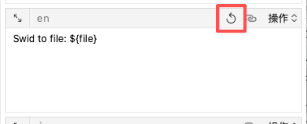
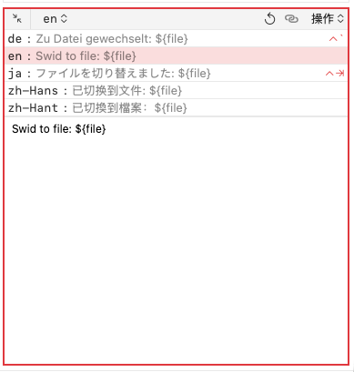

# 编辑区



编辑区是 TransX 的内容生产核心区域，位于主窗口右侧，提供了完整的多语言文案创建和编辑功能。该区域采用表单式布局，集成了智能输入辅助、自动翻译、格式验证等多项高级功能，旨在提升本地化内容的创建效率和质量。

## 界面布局

编辑区采用垂直布局，从上到下依次包含：
- Key 输入区
- 常量输入区
- 分组选择器
- 快速填充工具
- 多语言输入区域
- 操作按钮组（保存/取消/删除）

## 1. Key 输入

### 功能说明

Key 是多语言文案在代码中的唯一标识符，是 `NSLocalizedString` 等本地化API 的第一个参数。合理的 Key 命名对于代码的可读性和维护性至关重要。

### 输入规范

**命名约定：**
采用分层命名结构，清晰表达文案的用途和位置：

```
模块.功能.元素.动作

示例：
login.button.submit          // 登录按钮-提交
trade.alert.success          // 交易提示-成功
settings.label.username      // 设置标签-用户名
error.network.timeout        // 错误-网络-超时
```

**格式规则：**
- 使用小写字母
- 单词间用点号（.）或下划线（_）分隔
- 避免使用特殊字符和空格
- 长度建议控制在 3-100 个字符
- 不使用中文或其他非 ASCII 字符

### 智能辅助

**格式验证：**
在项目设置中可以配置 Key 的验证规则：
- 正则表达式验证
- 自定义命名规范检查
- 重复性检测（实时提示已存在的 Key）
- 长度限制

### 随机生成

点击输入框右侧的 🎲 按钮或使用快捷键 `⌘ + R` 生成随机 Key：

**生成策略：**
1. 基于当前设定的前缀
2. 使用项目配置的命名模板
3. 添加随机后缀确保唯一性
4. 符合项目的 Key 格式规范

**生成示例：**
```
当前分组：用户认证
模板：{group}.{type}.{random}
生成：auth.label.8f3k2d9s
```

### 复制与粘贴

**粘贴智能识别：**
- 自动清除多余空格和换行
- 转换大写为小写（如果规范要求）
- 替换非法字符为合法分隔符
- 提示格式问题并提供修正建议

## 2. 常量输入

### 功能说明

常量是代码中引用 Key 的更优雅方式，可以提供编译时检查和代码补全支持。将字符串 Key 转换为常量是一种最佳实践。

### 命名规范

**Swift 常量示例：**
```swift
// Key: login.button.submit
// 常量: LOGIN_BUTTON_SUBMIT

extension String {
    static let LOGIN_BUTTON_SUBMIT = "login.button.submit"
}

// 使用
Text(NSLocalizedString(.LOGIN_BUTTON_SUBMIT, comment: ""))
```

**Objective-C 常量示例：**
```objc
// .h 文件
extern NSString * const LOGIN_BUTTON_SUBMIT;

// .m 文件
NSString * const LOGIN_BUTTON_SUBMIT = @"login.button.submit";

// 使用
NSLocalizedString(LOGIN_BUTTON_SUBMIT, @"")
```

### 格式规则

**通用规范：**
- 全大写字母
- 单词间用下划线分隔
- 与 Key 保持语义一致
- 避免过长（建议 < 60 字符）

**自定义规则：**
在项目设置中配置：
- 命名风格（UPPER_CASE、PascalCase、camelCase）
- 前缀/后缀（如 `k`、`_KEY`）
- 特殊字符替换规则
- 缩写词处理（如 HTTP → HTTP 还是 Http）

### 自动转换

点击输入框右侧的 ➡️ 按钮或按下快捷键 `⌘ + T` 可以自动将 Key 转换为常量：

**转换规则示例：**
```
Key                          → 常量
login.button.submit          → LOGIN_BUTTON_SUBMIT
user.profile.edit            → USER_PROFILE_EDIT
error.network.timeout        → ERROR_NETWORK_TIMEOUT
settings.privacy.title       → SETTINGS_PRIVACY_TITLE
```

**自定义转换脚本：**
可以配置[自定义的转换脚本](https://github.com/JyHu/X/tree/main/Scripts/templates/const_generator)（JavaScript）：

### 质量建议
```
✅ 优秀：LOGIN_BUTTON_SUBMIT（清晰、规范）
⚠️  可改进：BTN_LOGIN（不够描述性）
❌ 不推荐：login_button_submit（应该全大写）
```

### 常量管理

**代码生成：**
可以批量导出所有常量定义：

```swift
// LocalizationKeys.swift（自动生成）
extension String {
    // MARK: - 用户认证
    static let LOGIN_BUTTON_SUBMIT = "login.button.submit"
    static let LOGIN_BUTTON_CANCEL = "login.button.cancel"
    static let LOGIN_ERROR_INVALID = "login.error.invalid"
    
    // MARK: - 交易
    static let TRADE_BUTTON_BUY = "trade.button.buy"
    static let TRADE_BUTTON_SELL = "trade.button.sell"
}
```

## 3. 分组选择

### 功能说明

分组是组织多语言文案的重要维度，合理的分组有助于团队协作和内容管理。

### 选择方式

**下拉列表：**
- 显示所有可用分组
- 显示每个分组的文案数量

**快速创建：**
- 在下拉框中输入不存在的分组名
- 系统提示创建新分组
- 回车确认创建并应用

## 4. 从粘贴板粘贴

### 功能说明

这是一个强大的批量输入功能，可以一次性填充所有语言的翻译内容，极大提升了内容创建效率。特别适合配合 AI 翻译工具或外部翻译服务使用。

### 工作原理

**数据格式：**
支持多种常见的多语言数据格式：

**格式 1：语言代码前缀**
```
en: Switched to file: ${file}
zh-Hans: 已切换到文件: ${file}
zh-Hant: 已切換到檔案：${file}
de: Zu Datei gewechselt: ${file}
ja: ファイルを切り替えました: ${file}
```

**格式 2：JSON 格式**
```json
{
  "en": "Switched to file: ${file}",
  "zh-Hans": "已切换到文件: ${file}",
  "zh-Hant": "已切換到檔案：${file}",
  "de": "Zu Datei gewechselt: ${file}",
  "ja": "ファイルを切り替えました: ${file}"
}
```

**格式 3：CSV格式**
```
en      zh-Hans         zh-Hant         de              ja
Submit  提交            提交            Einreichen      提出
```

### 使用流程

**步骤 1：准备数据**
使用 ChatGPT、DeepL、Google Translate 等工具翻译内容：

```
提示词示例：
请将以下英文翻译成中文简体、中文繁体、德语、日语，
并按以下格式输出：
en: [英文内容]
zh-Hans: [中文简体]
zh-Hant: [中文繁体]
de: [德语]
ja: [日语]

原文：Switched to file: ${file}
```

**步骤 2：复制结果**
将 AI 或翻译工具输出的格式化内容复制到粘贴板。

**步骤 3：一键填充**
- 点击 📋 "从粘贴板粘贴" 按钮
- 系统自动解析粘贴板内容
- 匹配语言代码，填充到对应输入框
- 提示成功填充的语言数量

**步骤 4：检查确认**
- 预览填充的内容
- 调整或修改不准确的翻译
- 保存文案

### 智能识别

**语言代码识别：**
支持多种语言代码标准：
- BCP 47（zh-Hans、en-US）
- ISO 639-1（zh、en）

**多行支持：**
内容可以包含换行，只要以支持的语言代码开头：

```
zh-Hans: 欢迎使用 TransX
这是一款强大的多语言管理工具
适用于 iOS 和 macOS 开发

en: Welcome to TransX
A powerful multilingual management tool
For iOS and macOS development
```

### 自动触发

如果粘贴板中有格式化的多语言内容，新建文案时会自动解析并填充。

### 高级用法

**配合翻译API：**
1. 在编辑区输入英文原文
2. 点击"翻译所有"按钮
3. 调用配置的翻译 API
4. 自动填充所有语言
5. 审核调整后保存

**批量导入：**
1. 准备 CSV 或 Excel 文件
2. 使用工具转换为支持的格式
3. 逐条复制粘贴或使用脚本批量处理

## 5. 语言内容输入框

### 功能概述

语言输入区是编辑区的核心部分，为项目支持的每种语言提供独立的输入框，确保所有语言版本的文案都能被妥善编辑和管理。

### 输入框布局

**每个输入框包含：**
- 左上角：
  - 语言代码标识（如 `en`、`zh-Hans`）
  - 放大按钮
- 主体：多行文本输入区域
- 右上角：操作按钮组
  - 恢复按钮（如果当前存在修改前的内容）
  - 操作菜单（翻译、复制等）

**自动布局：**
可以在设置中设置最大显示个数，如果超过设定数量会采用滑动页面的展示方式。

### 5.1 恢复按钮



**触发条件：**
当之前有修改过内容，并保存后，再次修改这条多语言文案时，右上角会显示一个 ↩️ 恢复按钮。

**功能说明：**
- 一键恢复到最后保存的状态
- 撤销当前输入框的所有修改
- 仅影响当前语言，不影响其他语言的输入框

**使用场景：**
- 误操作后快速恢复
- 尝试不同翻译方案时回退
- 清除错误的粘贴内容

**注意事项：**
- 恢复操作不可撤销
- 恢复后按钮自动隐藏
- 保存文案后，恢复按钮失效

### 5.2 操作菜单


点击输入框右上角的功能按钮，打开操作菜单，提供针对当前输入框的快捷操作。

#### 1. 复制

**功能说明：**
将当前输入框的内容复制到系统粘贴板。

**使用场景：**
- 复制到其他应用进行审校
- 分享给团队成员
- 作为翻译的参考文本

#### 2. 翻译

**功能说明：**
调用配置的翻译脚本，将当前输入框的内容翻译为该输入框对应的目标语言，并自动填充到输入框中。

**前提条件：**
1. 已在脚本管理中设置了翻译脚本且标记为使用状态
2. 当前输入框内容不为空

**工作流程：**
1. 点击"翻译"
2. 调用翻译脚本
3. 日志区显示翻译过程
4. 翻译完成后自动填充到输入框
5. 可以预览并确认或修改

**翻译脚本示例：**
[https://github.com/JyHu/X/tree/main/Scripts/templates/translate](https://github.com/JyHu/X/tree/main/Scripts/templates/translate)

**错误处理：**
- API 调用失败：显示错误信息，不修改输入框
- 网络超时：提示重试

#### 3. 翻译到

**功能说明：**
将当前输入框的内容作为源文本，翻译到其他一个或多个目标语言。

**使用场景：**
- 从熟悉的语言翻译到不熟悉的语言
- 以中文为基准翻译到多个其他语言
- 统一更新多个语言的翻译

**操作流程：**
1. 点击"翻译到"
2. 显示目标语言选择菜单项
3. 选择需要翻译的目标语言
4. 可以选择"其他所有语言"
5. 批量翻译并填充

**批量翻译示例：**
```
当前输入框：en = "Submit"
选择翻译到：zh-Hans, zh-Hant, ja, de

结果：
zh-Hans: "提交"
zh-Hant: "提交"
ja: "提出"
de: "Einreichen"
```

#### 4. 复制到

**功能说明：**
将当前输入框的内容直接复制到其他语言的输入框，不经过翻译。

**使用场景：**
- 多个语言使用相同的文案（如品牌名、专有名词）
- 临时占位，待后续专业翻译
- 某些语言暂时使用英文回退

**操作流程：**
1. 点击"复制到"
2. 选择目标语言
3. 直接复制原文

**示例：**
```
场景：品牌名在所有语言中保持一致

en: "TransX"
操作：复制到所有语言

结果：
zh-Hans: "TransX"
zh-Hant: "TransX"
ja: "TransX"
de: "TransX"
```

### 5.3 放大功能



**功能说明：**
放大单个输入框，提供更宽敞的编辑空间，特别适合处理长文本内容。

**触发方式：**
点击输入框左上角的放大按钮

**放大模式界面：**

**顶部导航：**
- 语言选择下拉框：快速切换到其他语言的输入框
- 显示/隐藏其他语言：控制是否显示其他语言的内容预览
- 关闭按钮：退出放大模式

**主编辑区：**
- 占据大部分屏幕空间
- 多行文本编辑器，支持：
  - 自动换行
  - 拼写检查
  - 字数统计

**预览区：**（可选显示）
- 显示所有其他语言的内容
- 便于对比和参考
- 点击可快速切换到该语言编辑

**语言快速切换：**
在放大模式下，可以使用快捷键快速切换到其他语言：
- `Control + ⇥`：切换到下一个语言
- `Control + Shift + ⇥`：切换到上一个语言

**使用场景：**
- 编辑长段落文本（如用户协议、帮助文档）
- 需要专注编辑单个语言时
- 对比参考其他语言的翻译
- 处理包含复杂格式的文本

**保存与关闭：**
- 关闭放大模式不会丢失未保存的修改
- 可以直接在放大模式下保存文案

## 编辑模式

### 新建模式

点击导航区的"新建"按钮进入新建模式：
- 所有输入框为空
- Key 输入框自动聚焦
- 不显示删除按钮
- 保存后可选择继续新建或关闭

### 编辑模式

从内容区选择文案进入编辑模式：
- 加载现有文案的所有信息
- 保存后返回内容区