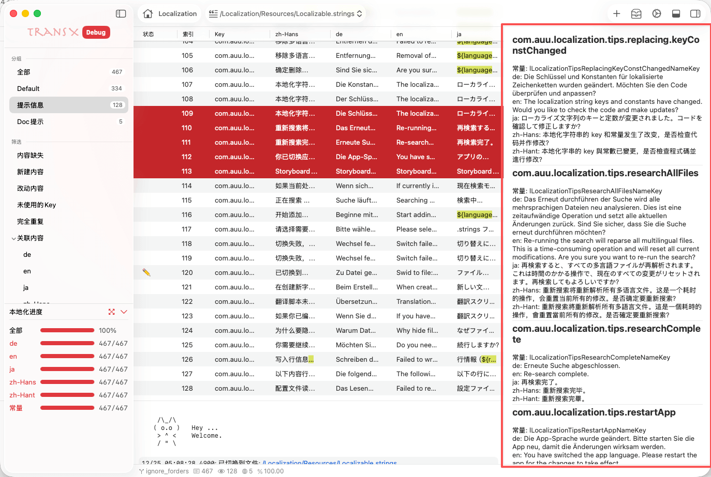

# 内容浏览区



内容浏览区是 TransX 提供的多选文案批量查看和对比功能区域，位于主窗口的编辑区相同位置。该区域在用户选中多条文案时自动激活，以列表形式展示所有选中条目的完整多语言信息，便于快速对比、审查和批量操作。

## 功能概述

### 触发条件

当在内容区选中 **2条或更多** 文案条目时，内容浏览区自动显示或展开，提供批量查看界面。

### 显示模式

```
com.auu.localization.about
Const: lLocalizationAboutNameKey
de: 关于
en: About
ja: について
zh-Hans: 关于
zh-Hant: 關於

com.auu.localization.actions
Const: lLocalizationActionsNameKey
de: Betrieb
en: Actions
ja: 操作
zh-Hans: 操作
zh-Hant: 操作

com.auu.localization.addToStaging
Const: lLocalizationAddToStagingNameKey
de: Zum Staging-Bereich hinzufügen
en: Add to Staging
ja: ステージングに追加
zh-Hans: 加入暂存区
zh-Hant: 加入暫存區

com.auu.localization.addYourMethod
Const: lLocalizationAddYourMethodNameKey
de: Bitte fügen Sie Ihre Methode hinzu.
en: Please add your method.
ja: あなたのメソッドを追加してください。
zh-Hans: 请添加你的方法。
zh-Hant: 請添加你的方法。

com.auu.localization.all
Const: lLocalizationAllNameKey
de: 全部
en: All
ja: すべて
zh-Hans: 全部
zh-Hant: 全部
```