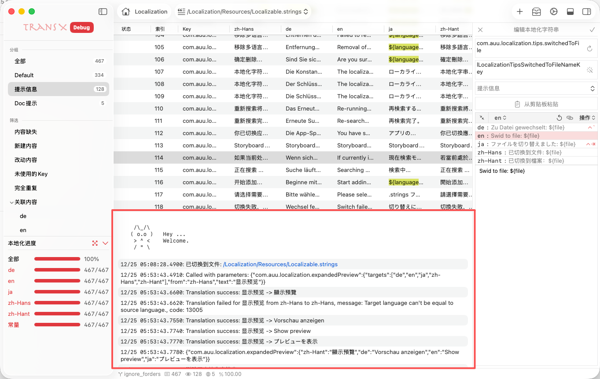

# 日志区



日志区位于主窗口底部，是 TransX 的操作记录和系统信息输出区域。该区域实时显示应用程序的所有操作日志、警告信息、错误提示和系统事件，为用户提供了透明的操作追踪和问题诊断能力。日志内容支持交互，可以点击链接快速执行相关操作或跳转到对应位置。

## 功能概述

### 日志类型

日志区会记录和显示多种类型的信息：

**操作日志：**
记录用户的所有操作行为，便于追溯和审计
- 文案创建、编辑、删除
- 文件切换
- 导入导出操作
- 分组管理
- 设置修改

**系统事件：**
记录应用程序内部的关键事件
- 应用启动和关闭
- 文件加载和保存
- 数据同步

**警告信息：**
提示潜在的问题或需要注意的情况
- 内容缺失提醒
- 格式不规范警告
- 占位符不匹配
- 未保存的修改

**错误提示：**
显示操作失败或系统异常
- 文件读写错误
- 网络请求失败
- API 调用异常
- 数据验证失败
- 脚本执行错误

**翻译日志：**
记录翻译服务的调用和结果
- 翻译请求发起
- API 调用状态
- 翻译结果返回
- 失败原因分析

## 日志格式

### 标准日志条目

每条日志包含以下信息：

**时间戳：**
- 精确到毫秒的时间记录
- 格式：`2025-12-27 14:30:25.123`

**交互链接：**
- 相关文件路径（点击打开）
- 文案 Key（点击定位）
- 错误代码（点击查看文档）

### 日志示例

```
2025/12/28 10:45:36.210 已切换到文件: /Localization/Resources/Localizable.strings
2025/12/28 10:46:36.014 使用 zh-Hans 语言内容补齐了 /Localization/Resources/Localizable.strings 中以下缺失的内容：
- com.auu.localization.about: de
- com.auu.localization.all: de
- com.auu.localization.allOtherLangs: ja
- com.auu.localization.backgroundColor: ja
2025/12/28 10:46:59.771 删除了本地化字符串：
com.auu.localization.createNewEntry
 ├╴ de: Neuen Eintrag erstellen
 ├╴ en: Create New Entry
 ├╴ ja: 新しい文言を作成
 ├╴ zh-Hans: 新建文案
 └╴ zh-Hant: 新建文案
com.auu.localization.createString
 ├╴ de: Neue Lokalisierungszeichenkette
 ├╴ en: New Localization String
 ├╴ ja: 新しいローカライズ文字列
 ├╴ zh-Hans: 新建文案
 └╴ zh-Hant: 新建文案

```

## 交互功能

### 点击链接

日志中的链接都可以点击执行相应操作：

**文件路径链接：**
- 点击后在 Finder 中打开文件位置
- 或在编辑器中打开文件
- 支持相对路径和绝对路径

**文案 Key 链接：**
- 点击后在内容区中定位该文案

**查看详情链接：**
- 展开显示完整的日志信息
- 包括堆栈跟踪（错误日志）
- 显示请求/响应数据（网络日志）