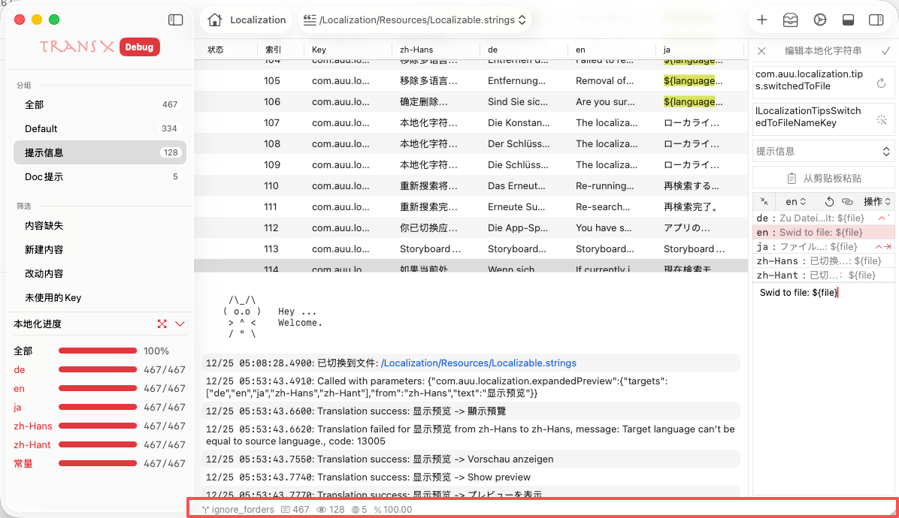

# Dock 栏

Dock 栏位于主窗口底部（或根据布局配置位于其他位置），是 TransX 的状态信息展示区域。该区域以紧凑的图标和数字形式实时显示当前项目的关键统计数据和状态指标，为用户提供项目概览和快速访问入口。点击任何一个icon都会弹出详细信息窗口，帮助用户深入了解项目状态。

## 功能概述

Dock 栏采用横向图标栏设计，每个图标代表一个信息维度。整体风格简洁直观，不占用过多屏幕空间，同时提供了丰富的信息密度。

## 显示内容

### 1. 分支名称

- 当前项目加载内容对应的Xcode项目的分支

### 2. 总条目数
- 当前项目的文案条目总数
- 数字：实时更新

### 3. 可见数量
- 当前列表中加载的条目总数
- 数字：实时更新

### 4. 语言数量

- 项目支持的语言种类数量
- 数字：语言总数

### 5. 本地化进度

- 当前选中的strings文件本地化的进度百分比
- 数字：实时更新