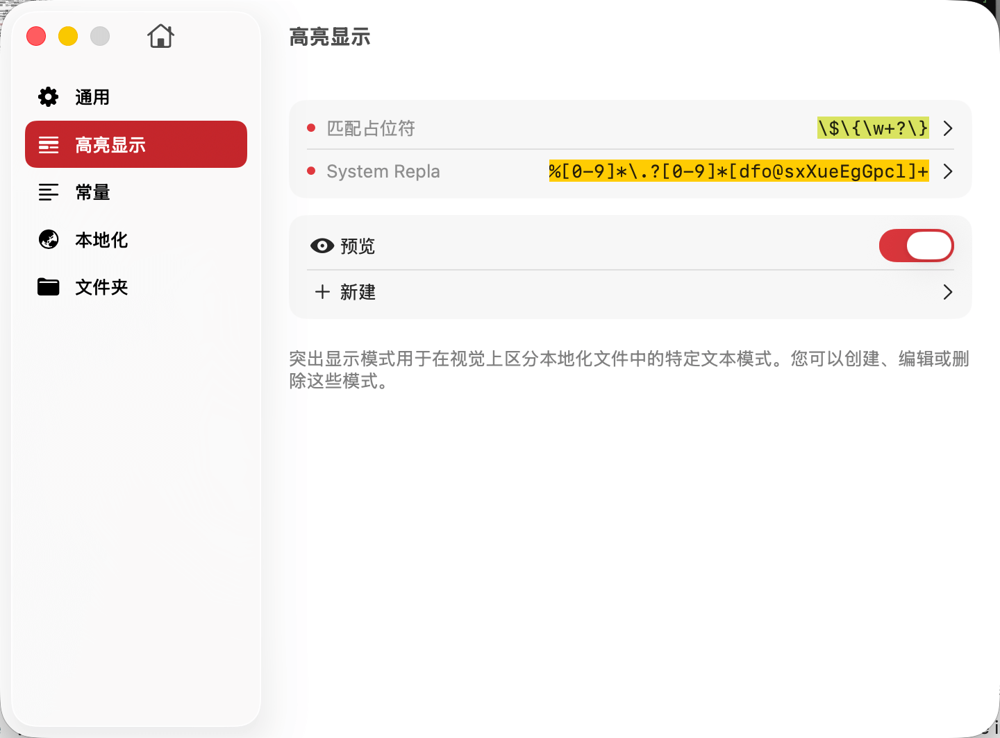
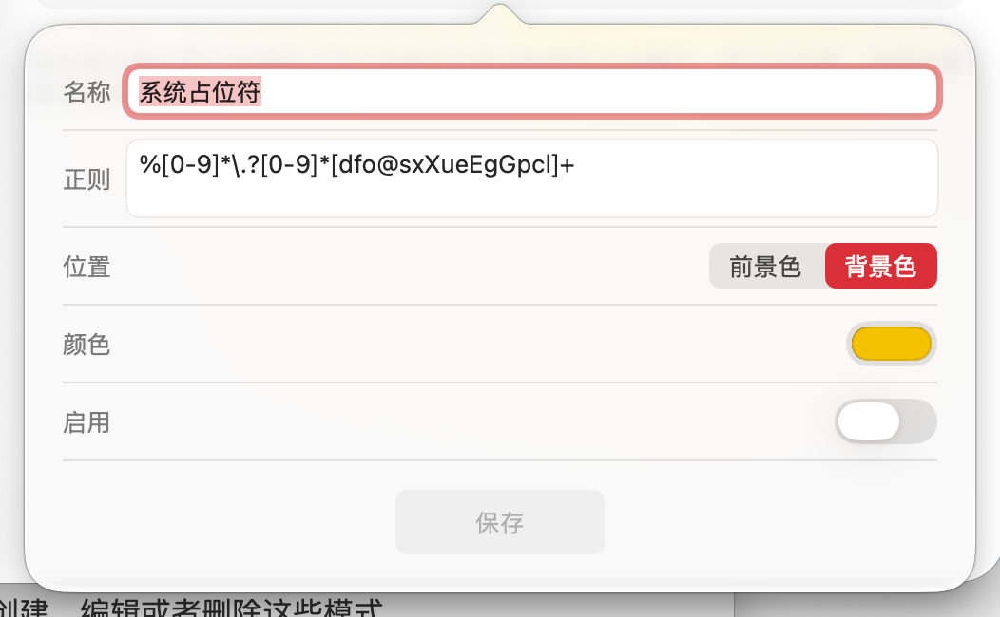

# 高亮显示



高亮显示功能用于在本地化文件的内容区中以视觉化方式标识特定的文本模式，帮助开发者快速识别和区分不同类型的内容。通过自定义高亮规则，您可以让重要的格式化信息、占位符、特殊标记等内容更加醒目，提升开发效率和内容管理的准确性。

## 功能概述

高亮显示模式允许您：

- **创建自定义规则**：根据项目需求定义任意数量的高亮规则
- **正则表达式匹配**：使用强大的正则表达式精确匹配需要高亮的内容
- **视觉区分**：为不同类型的内容设置不同的颜色和样式
- **灵活控制**：可随时启用或禁用特定的高亮规则
- **提升可读性**：在内容列表中直观地看到哪些字符串包含特定模式

## 应用场景

**1. 占位符高亮**

在本地化字符串中，占位符用于表示动态内容的插入位置。高亮占位符可以帮助您：
- 快速识别哪些字符串包含动态内容
- 检查占位符的格式是否正确
- 确保翻译时保留了所有占位符

常见占位符格式：
```
// iOS/macOS 格式化字符串
"Welcome, %@!" = "欢迎，%@！";
"You have %d messages" = "您有 %d 条消息";
"Progress: %.2f%%" = "进度：%.2f%%";

// 自定义占位符
"Hello, {username}!" = "你好，{username}！";
"Count: {{count}}" = "数量：{{count}}";
```

**2. 格式标记高亮**

高亮 HTML、Markdown 或自定义的格式标记：
```
// HTML 标签
"<b>Bold text</b>" = "<b>粗体文本</b>";
"Click <a href='...'>here</a>" = "点击<a href='...'>这里</a>";

// Markdown 语法
"**Important**: Read this" = "**重要**：请阅读";
"Visit [our site](url)" = "访问[我们的网站](url)";
```

**3. 特殊字符高亮**

标识需要特别注意的特殊字符：
```
// 转义字符
"Line 1\nLine 2" = "第一行\n第二行";
"Tab\tseparated" = "制表符\t分隔";

// 特殊符号
"Price: $10.99" = "价格：$10.99";
"Ratio: 16:9" = "比例：16:9";
```

**4. 变量和常量标记**

在某些框架中，使用特定语法表示变量：
```
// Angular i18n
"Hello {{name}}" = "你好 {{name}}";

// Vue i18n
"Total: {count} items" = "总计：{count} 项";

// ICU MessageFormat
"{count, plural, one {# item} other {# items}}"
```

## 配置说明



创建或编辑高亮规则时，您需要配置以下选项：

**1. 规则名称**
- 为高亮规则指定一个描述性的名称
- 建议使用能够说明匹配内容的名称，如"占位符"、"HTML标签"等

**2. 匹配正则表达式**
- 使用正则表达式语法定义匹配模式
- 正则表达式会在每个本地化字符串的值中进行搜索
- 支持捕获组、前后断言等高级特性

**3. 显示位置**
- **前景色**：高亮匹配的文本本身
- **背景色**：高亮匹配文本的背景区域
- **下划线**：在匹配文本下方添加下划线
- **删除线**：在匹配文本上添加删除线（用于标记废弃内容）

**4. 高亮颜色**
- 选择合适的颜色以区分不同类型的内容
- 建议使用对比度较高的颜色，确保在不同主题下都清晰可见

**5. 启用状态**
- 勾选以启用该高亮规则
- 未勾选的规则不会在列表中应用，但配置会被保留
- 可以临时禁用某些规则而无需删除配置

## 正则表达式示例

**匹配常见占位符格式：**

1. **iOS/macOS 格式化字符串**：
   ```regex
   %[@dfiuxXocsfeEgGpn]|\%\d+\$[@dfiuxXocsfeEgGpn]
   ```
   匹配：`%@`、`%d`、`%1$@`、`%2$d` 等

2. **自定义花括号占位符**：
   ```regex
   \{[a-zA-Z_][a-zA-Z0-9_]*\}
   ```
   匹配：`{name}`、`{count}`、`{user_id}` 等

3. **双花括号占位符**：
   ```regex
   \{\{[^}]+\}\}
   ```
   匹配：`{{name}}`、`{{count}}` 等

**匹配 HTML 标签：**

1. **所有 HTML 标签**：
   ```regex
   <[^>]+>
   ```
   匹配：`<b>`、`<a href="...">`、`</div>` 等

2. **特定标签（如粗体、斜体）**：
   ```regex
   <\/?[bi]>
   ```
   匹配：`<b>`、`</b>`、`<i>`、`</i>`

**匹配 Markdown 语法：**

1. **粗体和斜体**：
   ```regex
   \*\*[^*]+\*\*|\*[^*]+\*|__[^_]+__|_[^_]+_
   ```
   匹配：`**bold**`、`*italic*`、`__bold__`、`_italic_`

2. **链接语法**：
   ```regex
   \[([^\]]+)\]\([^\)]+\)
   ```
   匹配：`[text](url)`

**匹配转义字符：**

```regex
\\[nrtfvb0'"\\]
```
匹配：`\n`、`\t`、`\r`、`\\` 等

## 最佳实践

**1. 合理使用颜色**
- 不要使用过多不同的颜色，避免界面过于花哨
- 建议使用 3-5 种主要颜色，每种颜色代表一类内容
- 选择与编辑器主题协调的颜色

**2. 优先高亮重要内容**
- 占位符、格式标记等重要内容应使用醒目的颜色
- 次要内容可使用较淡的颜色或仅使用下划线

**3. 正则表达式优化**
- 避免使用过于宽泛的正则表达式，可能导致意外匹配
- 测试正则表达式确保其准确性，避免误报或漏报
- 对于复杂的匹配需求，可以拆分成多个简单的规则

**4. 定期审查规则**
- 随着项目演进，定期检查高亮规则是否仍然适用
- 移除不再需要的规则，保持配置的简洁性

**5. 团队协作**
- 在团队中统一高亮规则配置，确保所有成员看到一致的界面
- 将高亮规则配置写入项目文档，说明每种颜色的含义

**6. 性能考虑**
- 如果项目包含大量本地化条目，过多的高亮规则可能影响性能
- 如果发现界面卡顿，可以尝试禁用部分规则或简化正则表达式

## 示例配置

以下是一个完整的高亮配置示例：

| 规则名称 | 正则表达式 | 显示位置 | 颜色 | 用途 |
|---------|-----------|---------|------|------|
| iOS占位符 | `%[@dfiuxXocsfeEgGpn]` | 前景色 | #FF6B6B | 标识iOS格式化占位符 |
| 自定义占位符 | `\{[a-zA-Z_][a-zA-Z0-9_]*\}` | 背景色 | #FFD93D | 标识自定义占位符 |
| HTML标签 | `<[^>]+>` | 前景色 | #6BCF7F | 标识HTML格式标记 |
| 转义字符 | `\\[nrtfvb0'"\\]` | 下划线 | #A78BFA | 标识转义序列 |
| 废弃标记 | `\[DEPRECATED\]` | 删除线 | #9CA3AF | 标识已废弃的内容 |

## 注意事项

- 高亮显示仅影响 TransX 界面的视觉呈现，不会修改 .strings 文件的实际内容
- 正则表达式必须是有效的正则表达式，否则该规则会被忽略
- 高亮规则按照配置顺序依次应用，后面的规则可能覆盖前面的效果
- 如果某个规则的正则表达式性能较差，可能影响界面响应速度
- 建议在测试环境中验证高亮规则，确保其按预期工作后再应用到生产项目