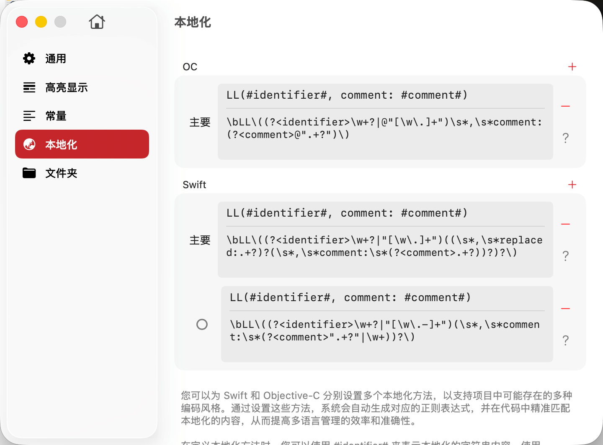

# 本地化方法



本地化方法配置是 TransX 的核心功能之一，用于定义项目中如何调用本地化字符串的函数或宏。通过配置本地化方法，TransX 能够精确识别代码中的本地化调用，实现智能搜索、自动替换、未本地化字符串检测等高级功能。

## 功能概述

TransX 支持为 Swift 和 Objective-C 分别配置多个本地化方法，以适应不同的编码风格和框架需求。系统会根据您配置的方法自动生成对应的正则表达式，在代码中精确匹配本地化内容。

**主要功能：**

1. **识别本地化调用**：扫描代码，找出所有本地化方法的调用位置
2. **提取 Key 和注释**：从本地化调用中提取 identifier（Key）和 comment（注释）
3. **查找未本地化字符串**：检测代码中硬编码的字符串，提示需要本地化
4. **自动替换和重构**：支持 Key 重命名时自动更新代码中的引用
5. **支持多种风格**：兼容系统 API、第三方框架、自定义宏等多种本地化方式

## 配置说明

### 定义本地化方法

在配置本地化方法时，使用特殊占位符来表示不同的参数：

- **`#identifier#`**：表示本地化字符串的 Key（必需）
- **`#comment#`**：表示注释信息（可选）

**配置示例：**

**Swift 本地化方法：**

1. **系统标准方法**：
   ```
   NSLocalizedString(#identifier#, comment: #comment#)
   ```

2. **自定义简化宏**：
   ```
   LL(#identifier#, comment: #comment#)
   LL(#identifier#)
   ```

3. **带 Bundle 参数**：
   ```
   NSLocalizedString(#identifier#, bundle: Bundle.main, comment: #comment#)
   ```

**Objective-C 本地化方法：**

1. **系统标准方法**：
   ```
   NSLocalizedString(@#identifier#, @#comment#)
   NSLocalizedStringFromTable(@#identifier#, @"TableName", @#comment#)
   ```

2. **自定义宏**：
   ```
   LL(@#identifier#, @#comment#)
   LL(@#identifier#)
   ```

### 自动生成正则表达式

配置本地化方法后，TransX 会自动生成对应的正则表达式用于代码扫描。系统会确保：

- 正确匹配函数调用语法
- 准确捕获 identifier 和 comment 参数
- 处理转义字符和字符串边界
- 支持参数的可选性

**自动生成示例：**

配置：`LL(#identifier#, comment: #comment#)`

生成的正则表达式（简化版）：
```regex
\bLL\((?<identifier>\w+?|"[\w\.-]+")(\s*,\s*comment:\s*(?<comment>".+?"|\w+))?\)
```

**正则表达式说明：**
- `\bLL\(`：匹配函数名 `LL(`
- `(?<identifier>...)`：命名捕获组，捕获 identifier 参数
- `(\s*,\s*comment:\s*(?<comment>...))?`：可选的 comment 参数
- `(?<comment>...)`：命名捕获组，捕获 comment 参数

### 命名捕获组规范

如果您选择手动调整正则表达式，必须遵循以下命名规范：

**必需的命名捕获组：**

1. **`identifier`**：捕获本地化 Key 的值
   ```regex
   (?<identifier>...)
   ```

2. **`comment`**（如果本地化方法包含 comment 参数）：捕获注释内容
   ```regex
   (?<comment>...)
   ```

**示例：完整的手动正则表达式**

本地化方法：`MyLocalizedString(#identifier#, withComment: #comment#)`

手动编写的正则表达式：
```regex
\bMyLocalizedString\(\s*(?<identifier>@?"[^"]+"|[a-zA-Z_]\w*)\s*,\s*withComment:\s*(?<comment>@?"[^"]*"|[a-zA-Z_]\w*)\s*\)
```

**正则说明：**
- `(?<identifier>@?"[^"]+"|[a-zA-Z_]\w*)`：匹配字符串字面量或常量名
  - `@?"[^"]+"`: Objective-C 字符串字面量（如 `@"key"` 或 `"key"`）
  - `[a-zA-Z_]\w*`: 常量名（如 `myKey`）
- `(?<comment>@?"[^"]*"|[a-zA-Z_]\w*)`：匹配注释内容

## 常见本地化方法配置

### iOS/macOS 系统 API

**Swift：**

```
NSLocalizedString(#identifier#, comment: #comment#)
NSLocalizedString(#identifier#, tableName: nil, bundle: Bundle.main, value: "", comment: #comment#)
```

**Objective-C：**

```
NSLocalizedString(@#identifier#, @#comment#)
NSLocalizedStringFromTable(@#identifier#, @"TableName", @#comment#)
NSLocalizedStringFromTableInBundle(@#identifier#, @"TableName", [NSBundle mainBundle], @#comment#)
NSLocalizedStringWithDefaultValue(@#identifier#, @"TableName", [NSBundle mainBundle], @"DefaultValue", @#comment#)
```

### 自定义宏

许多项目会定义自己的本地化宏来简化调用：

**Swift：**

```swift
// 定义
func LL(_ key: String, comment: String = "") -> String {
    return NSLocalizedString(key, comment: comment)
}

// 配置
LL(#identifier#)
LL(#identifier#, comment: #comment#)
```

**Objective-C：**

```objc
// 定义
#define LL(key) NSLocalizedString(key, @"")
#define LL_COMMENT(key, comment) NSLocalizedString(key, comment)

// 配置
LL(@#identifier#)
LL_COMMENT(@#identifier#, @#comment#)
```

## 主要本地化方法

TransX 允许您为每种语言指定一个"主要的本地化方法"，作为自动本地化未翻译字符串时的默认方法。

**应用场景：**

当 TransX 检测到代码中有硬编码的字符串需要本地化时，会：

1. 自动生成一个本地化 Key
2. 在 .strings 文件中创建对应条目
3. 使用主要本地化方法替换代码中的硬编码字符串

**示例流程：**

**检测到的代码：**
```swift
// ❌ 硬编码字符串
let title = "Settings"
```

**配置主要方法为** `LL(#identifier#)` **后，TransX 可以自动：**

1. 生成 Key：`"app.settings.title"`
2. 添加到 Localizable.strings：
   ```
   "app.settings.title" = "Settings";
   ```
3. 替换代码：
   ```swift
   // ✅ 使用本地化方法
   let title = LL(settingsTitleKey)
   ```

**最佳实践：**

- 选择项目中最常用的本地化方法作为主要方法
- 确保主要方法在整个项目中都可用（已定义或导入）
- 对于 Swift 和 Objective-C 混编项目，分别设置各自的主要方法

## 配置多个本地化方法

在实际项目中，可能会同时使用多种本地化方法：

**示例场景：**

```swift
// 场景 1：使用系统 API
let text1 = NSLocalizedString("key1", comment: "Description")

// 场景 2：使用自定义简化宏
let text2 = LL("key2")

// 场景 3：使用带 Bundle 的方法（用于 Framework）
let text3 = NSLocalizedString("key3", bundle: MyFramework.bundle, comment: "")
```

**配置方法：**

在 TransX 中为 Swift 添加多个本地化方法配置：

1. `NSLocalizedString(#identifier#, comment: #comment#)`
2. `LL(#identifier#)`
3. `LL(#identifier#, comment: #comment#)`
4. `NSLocalizedString(#identifier#, bundle: Bundle.main, comment: #comment#)`

TransX 会使用所有配置的方法进行代码扫描，确保不遗漏任何本地化调用。

## 最佳实践

### 1. 统一本地化方法

在项目初期确定一种或几种本地化方法，并在整个项目中统一使用：

```swift
// ✅ 推荐：统一使用自定义宏
LL("key1")
LL("key2")
LL("key3")

// ❌ 不推荐：混用多种风格
NSLocalizedString("key1", comment: "")
LL("key2")
Localize("key3")  // 第三种方法
```

### 2. 使用类型安全的常量

结合常量配置，使用类型安全的 Key：

```swift
// ✅ 推荐：使用常量
LL(settingsTitleKey)

// ⚠️ 可接受：使用字符串字面量
LL("app.settings.title")

// ❌ 不推荐：动态生成 Key
LL("app.\(moduleName).title")  // 无法被 TransX 识别
```

### 3. 提供有意义的 Comment

虽然 comment 参数在运行时不起作用，但它对于本地化管理很有价值：

```swift
// ✅ 推荐：提供有意义的 comment
LL("app.settings.title", comment: "The title displayed on settings screen")

// ❌ 不推荐：无意义的 comment
LL("app.settings.title", comment: "")
```

**Comment 的作用：**

- 帮助翻译人员理解上下文
- 在 .strings 文件中作为注释保存
- 使用 genstrings 工具时会自动提取
- 便于团队成员理解本地化内容的用途

### 4. 在项目文档中说明

在 README 或开发文档中明确说明：

- 项目使用的本地化方法
- 如何定义和调用本地化宏
- 如何在 TransX 中配置这些方法
- 什么时候应该使用本地化，什么时候不需要

## 注意事项

- **避免动态 Key**：TransX 依赖静态分析，动态生成的 Key 无法被识别
- **正则表达式验证**：手动编写的正则表达式必须包含正确的命名捕获组
- **多行调用**：确保正则表达式能够处理跨行的函数调用
- **特殊字符转义**：在正则表达式中正确转义特殊字符

## 故障排查

**问题：TransX 无法识别本地化调用**

**可能原因：**
- 本地化方法未配置或配置错误
- 正则表达式不匹配实际的调用语法
- 代码中使用了未配置的本地化方法

**解决方法：**
1. 检查本地化方法配置是否正确
2. 使用正则测试工具验证正则表达式
3. 查看 TransX 日志，确认错误信息
4. 尝试添加更多本地化方法配置

## 总结

本地化方法配置是 TransX 正确识别和管理项目本地化内容的基础。通过合理配置：

- **提升识别准确性**：精确匹配代码中的本地化调用
- **支持多种风格**：兼容不同的本地化方法和框架
- **自动化处理**：支持自动查找、替换、重构等功能
- **灵活扩展**：可以随时添加新的本地化方法配置

建议在项目开始时就明确本地化方法，并在 TransX 中正确配置，确保整个开发周期中本地化管理的顺畅进行。