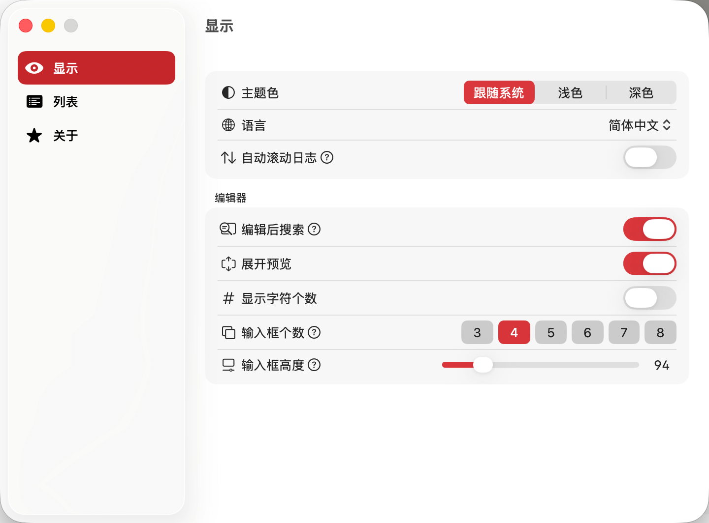

# 显示设置



## 概述

显示设置用于配置 TransX 应用的全局视觉效果和展示样式。这些设置会影响整个应用程序的外观和用户体验,适用于所有打开的项目。通过合理配置显示选项,您可以打造一个符合个人习惯和工作环境的理想界面。

## 配置项说明

### 主题色

控制应用的整体配色方案,提供三种选择:

**可选项:**
- **跟随系统**: 自动同步 macOS 的外观设置
  - 当系统切换到浅色模式时,应用自动切换到浅色主题
  - 当系统切换到深色模式时,应用自动切换到深色主题
  - 适合习惯让应用与系统保持一致外观的用户
  
- **浅色**: 固定使用浅色主题
  - 白色背景,深色文字
  - 适合在明亮环境下工作
  - 对眼睛刺激相对较小,适合长时间使用
  
- **深色**: 固定使用深色主题
  - 深色背景,浅色文字
  - 适合在暗光环境下工作
  - 减少屏幕亮度,降低眼睛疲劳

**推荐设置:**
- 日间工作建议使用浅色主题
- 夜间工作建议使用深色主题
- 希望保持一致体验的用户可选择跟随系统

### 语言

设置 TransX 应用界面的显示语言。该设置会影响应用内所有菜单、按钮、提示信息等界面元素的语言。

**当前支持的语言:**
- 简体中文 (zh-Hans)
- 繁体中文 (zh-Hant)
- 英语 (English)
- 日语 (日本語)
- 德语 (Deutsch)

**后续计划:**
- 法语 (Français)
- 西班牙语 (Español)
- 韩语 (한국어)
- 更多语言持续添加中...

**注意事项:**
- 修改语言设置后需要重启应用才能完全生效
- 选择您最熟悉的语言,以获得最佳使用体验
- 界面语言不会影响项目中 .strings 文件的内容

### 自动滚动日志

控制日志区是否自动滚动到最新记录。

**功能说明:**
- **开启**: 当有新的日志消息产生时,日志区会自动滚动到底部显示最新内容
- **关闭**: 日志区保持当前滚动位置,不会自动跳转到最新日志

**默认设置:** 关闭

**适用场景:**
- **建议开启**: 需要实时监控应用操作状态,关注最新日志信息
- **建议关闭**: 需要查看历史日志,不希望被新日志打断阅读

### 编辑后搜索

控制在编辑区保存内容后是否自动触发搜索操作。

**功能说明:**
- 当开启此功能且当前处于搜索状态(存在有效的搜索关键词)时
- 在编辑区保存内容后,会立即使用当前搜索关键词重新执行搜索
- 搜索结果会自动更新,反映最新的修改

**默认设置:** 关闭

**适用场景:**
- **建议开启**: 正在批量修改某类内容,需要实时查看修改后的搜索结果
- **建议关闭**: 编辑过程中不需要频繁更新搜索结果,避免界面频繁刷新

**工作流程示例:**
1. 搜索关键词 "login"
2. 编辑某个包含 "login" 的条目
3. 保存修改
4. 如果开启了"编辑后搜索",会自动重新搜索 "login",结果列表实时更新

### 展开预览

控制编辑区输入框放大模式下是否显示其他语言的预览内容。

**功能说明:**
- 在编辑区,当点击某个语言输入框的放大按钮进入放大模式时
- 如果开启此选项,除了当前编辑的语言外,还会在下方显示其他所有语言的内容预览
- 如果关闭此选项,只显示当前编辑语言的输入框

**默认设置:** 开启

**适用场景:**
- **建议开启**: 编辑时需要参考其他语言的翻译内容
- **建议关闭**: 希望专注于当前语言的编辑,避免其他内容干扰

**使用技巧:**
- 放大模式下可以通过快捷键 `Control + ^` 或 `Control + Tab` 切换不同语言
- 预览区域只读,不支持直接编辑

### 显示字符个数

控制编辑区输入框是否显示当前输入内容的字符数统计。

**功能说明:**
- 开启后,每个语言输入框的标题栏会实时显示当前输入文本的字符数
- 例如: `zh-Hans (23)`表示简体中文输入了 23 个字符

**默认设置:** 关闭

**适用场景:**
- **建议开启**: 
  - 对字符串长度有限制要求(如界面显示空间有限)
  - 需要控制不同语言翻译的字符数保持接近
  - 进行内容质量审核,检查翻译是否过长或过短
  
- **建议关闭**: 
  - 对字符数没有特殊要求
  - 希望界面更简洁

**注意事项:**
- 统计的是字符数而非字节数
- 中文、英文等不同语言的字符都按1个字符计算
- 包含标点符号、空格、换行符等所有可见和不可见字符

### 输入框个数

设置编辑区最多同时显示多少个语言输入框。

**功能说明:**
- 由于显示器高度有限,当项目支持的语言数量较多时,可能无法在编辑区同时显示所有语言的输入框
- 通过此设置可以控制最多显示几个输入框
- 如果实际语言数量超过设置值,编辑区会变为可滚动状态

**默认设置:** 根据屏幕分辨率自动计算

**推荐设置:**
- **小屏幕(13寸及以下)**: 3-5 个
- **中等屏幕(15-16寸)**: 5-7 个  
- **大屏幕(27寸及以上)**: 8-10 个

**注意事项:**
- 设置过多会导致每个输入框高度过小,不利于编辑长文本
- 设置过少会导致频繁滚动,影响工作效率
- 建议根据实际项目的语言数量和屏幕大小进行调整

### 输入框高度

设置当输入框个数较多需要滚动时,每个输入框的固定高度。

**功能说明:**
- 当编辑区处于滚动状态时(语言数量超过"输入框个数"设置)
- 每个输入框会使用此处设置的固定高度
- 以像素(px)为单位

**默认设置:** 120px

**推荐设置:**
- **短文本项目**: 80-100px (如按钮文字、标题等)
- **常规文本项目**: 120-150px (如提示信息、说明文字等)
- **长文本项目**: 180-250px (如帮助文档、政策条款等)

**注意事项:**
- 设置过小会导致长文本内容需要在输入框内滚动查看
- 设置过大会减少同屏可见的输入框数量,增加整体滚动操作
- 可根据项目中文本的平均长度进行调整

## 配置访问方式

### 打开设置
- **菜单栏**: TransX → 偏好设置 → 显示
- **快捷键**: `Command + ,` 然后选择"显示"标签页

### 保存设置
- 所有显示设置都会自动保存
- 无需手动保存,修改后立即生效(语言设置除外)

## 最佳实践

### 日间工作配置
```
主题色: 浅色或跟随系统
语言: 简体中文(或您偏好的语言)
自动滚动日志: 关闭
编辑后搜索: 根据需要
展开预览: 开启
显示字符个数: 开启
输入框个数: 5-7个
输入框高度: 120-150px
```

### 夜间工作配置
```
主题色: 深色或跟随系统
语言: 简体中文(或您偏好的语言)
自动滚动日志: 开启(便于监控)
编辑后搜索: 开启
展开预览: 开启
显示字符个数: 开启
输入框个数: 根据屏幕大小
输入框高度: 150-180px(深色模式下可适当增大)
```

### 性能优先配置
```
主题色: 浅色(深色模式渲染略消耗资源)
自动滚动日志: 关闭
编辑后搜索: 关闭
展开预览: 关闭
显示字符个数: 关闭
```

## 故障排查

**问题: 修改语言后界面未完全切换**
- 解决: 完全退出应用后重新启动

**问题: 主题色切换后部分区域颜色未更新**
- 解决: 切换到其他主题再切换回来,或重启应用

**问题: 输入框高度设置不生效**
- 解决: 检查是否处于滚动状态,只有在滚动状态下高度设置才会生效

显示设置是打造个性化工作环境的基础,合理配置可以显著提升使用体验和工作效率。
