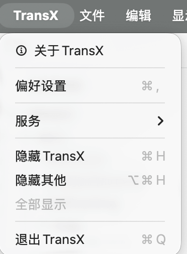
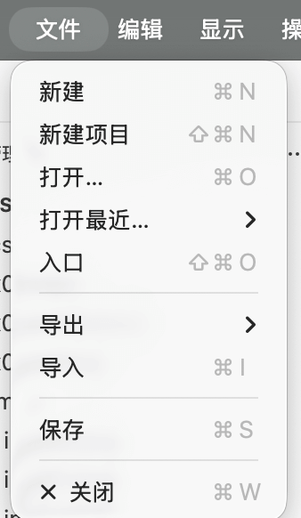
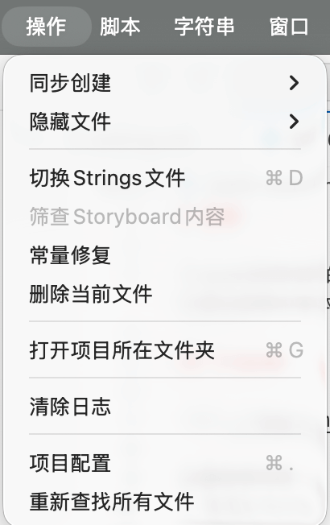
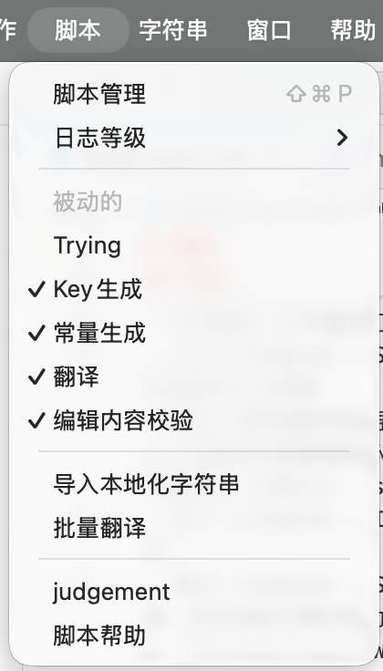

# 菜单

TransX 提供了丰富的菜单系统和快捷键支持，让您能够通过键盘快速执行各种操作，无需频繁使用鼠标。熟练掌握这些快捷键可以显著提升工作效率。本文档详细介绍应用程序菜单栏中的各个菜单项及其对应的快捷键。

## TransX



应用程序主菜单，包含全局级别的应用管理功能。这是 macOS 标准应用菜单的位置，在 Windows 和 Linux 系统中，这些选项通常会整合到其他菜单中。

### 菜单项说明

#### 关于 TransX
显示应用程序的基本信息，包括：
- 应用程序版本号和构建信息
- 开发团队和版权声明
- 许可证（License）状态和类型
- 官方网站和技术支持链接

这个对话框也是验证您使用的 TransX 版本的主要途径，在报告问题或寻求技术支持时，版本信息是重要的参考。

#### 偏好设置 <kbd>⌘,</kbd>
打开偏好设置窗口，用于配置 TransX 的全局行为和外观。详细配置选项请参考 [偏好设置](./0x05%20setting.md) 文档。

快捷键 `Command + ,`（逗号）是 macOS 应用程序的标准偏好设置快捷键，符合系统级交互惯例。

#### 隐藏 TransX <kbd>⌘H</kbd>
隐藏 TransX 窗口，但应用程序继续在后台运行。这是 macOS 标准的窗口管理功能，用于快速清理桌面空间而不关闭应用程序。

#### 隐藏其他应用 <kbd>⌥⌘H</kbd>
隐藏除 TransX 之外的所有其他应用程序窗口，让您专注于本地化工作。快捷键为 `Option + Command + H`。

#### 全部显示
显示所有之前隐藏的应用程序窗口，恢复完整的工作环境。

#### 退出 TransX <kbd>⌘Q</kbd>
完全退出应用程序。TransX 会在退出前保存所有未保存的项目配置，并询问是否保存正在编辑的内容。

## 文件



文件菜单包含项目和文件管理相关的核心操作，是日常使用频率最高的菜单之一。这里集中了从创建新项目到导入导出数据的完整文件操作流程。

### 菜单项详解

#### 新建 <kbd>⌘N</kbd>
在当前 `.strings` 文件中创建一个新的本地化条目。执行此命令后，会在主窗口启动编辑区，您可以立即输入新的键值对。

**使用场景**：
- 添加新的 UI 文本
- 补充遗漏的本地化内容
- 快速创建测试条目

快捷键 `Command + N` 遵循"New"的通用约定。

#### 新建项目 <kbd>⇧⌘N</kbd>
启动新建项目向导，创建一个全新的 TransX 项目。会引导您完成项目选择、参数配置、常量设置等初始化步骤。详见 [新建项目](./0x02%20new%20project.md)。

快捷键 `Shift + Command + N` 是"New Project"的标准快捷键，在很多 IDE 中都采用此约定。

#### 打开 <kbd>⌘O</kbd>
打开一个已存在的 TransX 项目。会弹出文件选择器，您可以浏览并选择之前创建的项目配置文件。

**支持的操作**：
- 通过文件浏览器选择项目
- 拖拽项目文件夹到 TransX 图标
- 在 Finder 中双击项目配置文件

快捷键 `Command + O` 是"Open"的通用约定。

#### 打开最近
快速访问最近打开过的项目列表。TransX 会记录最近访问的项目及其打开时间，让您能够快速切换工作项目。

**功能特点**：
- 显示项目名称和路径
- 显示最后访问时间
- 支持清除历史记录

这个功能对于需要在多个项目间频繁切换的开发者特别有用。

#### 入口 <kbd>⇧⌘O</kbd>
返回到应用程序启动时的入口页面。入口页面提供了三个选项：
1. 创建新项目
2. 打开已有项目
3. 访问最近的项目

这个功能允许您在不关闭当前项目的情况下快速切换到项目选择界面，方便多项目管理。

快捷键 `Shift + Command + O` 可以理解为"Open Entry"。

#### 导出
将当前项目的本地化内容导出为外部格式。TransX 支持多种导出目标：

**导出到项目**（必要操作）：
- 将所有修改写回到原始的 `.strings` 文件
- 更新常量文件（如果启用了常量模式）
- 这是完成编辑后的**必须操作**，否则修改不会生效

**导出到外部格式**：
- **CSV**：通用的表格格式，可用 Excel 或 Google Sheets 打开，方便与翻译团队协作
- **JSON**：结构化数据格式，便于脚本处理或与其他工具集成
- **XML**：XML 本地化交换文件格式，专业翻译工具的标准格式

**重要提示**：每次编辑完本地化内容后，必须执行"导出到项目"，否则您的修改只存在于 TransX 的内部数据库中，不会写入实际的 `.strings` 文件，Xcode 构建时看不到这些修改。

#### 导入 <kbd>⌘I</kbd>
从外部文件导入本地化内容到当前项目。TransX 支持导入：

**CSV 格式**：
- 第一行应为标题行，包含语言代码
- 后续每行为一个本地化条目
- 自动识别分隔符（逗号、制表符等）

**JSON 格式**：
- 支持嵌套结构或扁平键值对
- 自动映射到对应的语言

**导入策略**：
- **合并模式**：保留现有内容，只添加新条目或更新修改的条目
- **覆盖模式**：完全替换现有内容（谨慎使用）
- **冲突处理**：当键值冲突时，选择保留原值或使用新值

**典型使用场景**：
- 从翻译团队接收 CSV 格式的翻译内容
- 批量添加新的本地化条目
- 从其他本地化工具迁移数据

快捷键 `Command + I` 代表"Import"。

#### 保存 <kbd>⌘S</kbd>
保存当前项目的配置变更。注意，这里保存的是：
- 项目设置（偏好配置）
- 文件筛选规则
- 常量配置
- 其他元数据

**不包括**本地化文案的实际内容。文案内容需要通过"导出到项目"来持久化。

快捷键 `Command + S` 是最常用的"Save"快捷键。

**设计说明**：将配置保存和内容导出分离的设计是为了：
1. 避免误操作覆盖文件
2. 允许批量编辑后统一导出
3. 支持预览和验证后再提交

#### 关闭 <kbd>⌘W</kbd>
关闭当前窗口。如果有未保存的配置或未导出的内容修改，TransX 会弹出提示询问是否保存。

快捷键 `Command + W` 是"Close Window"的标准快捷键。

## 操作



操作菜单汇集了 TransX 的高级功能和批量处理工具，以及分散在应用各处的重要功能的集中入口。这些操作通常涉及整个项目级别的处理，需要一定的时间来执行。

### 菜单项详解

#### 同步创建
切换"同步创建"模式的显示状态。同步创建是一个便捷功能，用于在编辑某个语言的内容时，自动在其他语言中创建相同键的空白条目。

**工作原理**：
- 当在基础语言中添加新条目时
- TransX 自动在所有选中的其他语言的 `.strings` 文件中创建相同的键值、常量等

**使用场景**：
- 快速建立多语言结构骨架
- 确保所有语言的键值保持同步
- 避免遗漏某些语言的翻译

**界面影响**：
此菜单项控制主窗口编辑区是否显示同步创建的相关控件和提示。

#### 隐藏文件
管理哪些 `.strings` 文件在导航区中显示或隐藏。打开此选项会显示一个文件列表，您可以：
- 勾选要显示的文件
- 取消勾选要临时隐藏的文件
- 隐藏的文件不会被删除，只是不在界面中显示

**典型应用**：
- 隐藏已废弃但尚未删除的旧文件
- 隐藏不需要当前处理的文件，简化界面
- 隐藏自动生成的 Storyboard 或 XIB 的 `.strings` 文件

这个功能不影响文件的实际存在，只影响 TransX 界面中的可见性。

#### 切换 strings 文件
在主窗口中快速切换当前管理的 `.strings` 文件。虽然可以通过导航区点击切换，但这个菜单提供了一个快捷列表，显示：
- 所有可用的 `.strings` 文件
- 每个文件的路径（如有重名）
- 当前选中的文件（标记）

**快捷键提示**：
很多开发者会为常用的几个文件设置自定义快捷键，通过快捷键直接跳转。

#### 筛查 Storyboard 内容
针对 Interface Builder（Storyboard/XIB）自动生成的 `.strings` 文件的特殊功能。

**背景知识**：
当 Xcode 项目中有 Storyboard 或 XIB 文件启用了本地化，Xcode 会自动生成对应的 `.strings` 文件。这些文件的内容与 Storyboard 中的视图元素强相关，包含 Object ID 和控件类型等信息。

**功能说明**：
此操作会：
1. 解析对应的 Storyboard/XIB 文件
2. 检查当前 `.strings` 文件中的所有条目
3. 标识出已失效的条目（对应的视图元素已被删除）
4. 标识出缺失的条目（新增的需要本地化的视图元素）
5. 提供批量清理和补全选项

**使用时机**：
- Storyboard 经过重大改动后
- 发现本地化内容与界面不匹配时
- 定期维护，清理冗余条目

**可用性**：
此菜单项仅在当前选中的 `.strings` 文件对应于 Storyboard 或 XIB 时才启用（不灰置）。

#### 常量修复
自动化工具，用于修复代码中直接使用字符串键值的地方，将其替换为对应的常量引用。

**前提条件**：
1. 项目启用了常量模式
2. 在项目配置中正确设置了本地化方法（例如 `NSLocalizedString`、`LL()` 等）

**工作流程**：
1. 扫描项目代码文件（.swift, .m, .mm 等）
2. 识别本地化方法的调用（如 `NSLocalizedString("key", comment: "")`）
3. 检查是否直接使用了字符串键值而非常量
4. 查找对应的常量定义
5. 替换为常量引用（如 `NSLocalizedString(lMyKey, comment: "")`）

**示例**：

修复前：
```swift
let title = NSLocalizedString("com.app.settings.title", comment: "")
let message = LL("com.app.error.network")
```

修复后：
```swift
let title = NSLocalizedString(lSettingsTitle, comment: "")
let message = LL(lErrorNetwork)
```

**价值**：
这个功能对于将旧项目迁移到常量模式特别有用，可以自动完成大量重复性的代码修改工作。

#### 删除当前文件
删除当前在主窗口中选中的 `.strings` 文件。

**⚠️ 高危操作警告**：
此操作会：
- 从文件系统中物理删除文件
- 同时删除所有语言版本的对应文件
- 删除相关的常量定义
- 操作**不可逆**（除非有版本控制）

**执行流程**：
1. TransX 会弹出多重确认对话框
2. 显示将要删除的文件列表
3. 记录删除操作到日志

**使用场景**：
- 项目重构，移除废弃的模块
- 合并或拆分本地化文件
- 清理错误创建的文件

**最佳实践**：
- 删除前确保有版本控制备份
- 确认文件确实不再被任何代码引用
- 考虑先使用"隐藏文件"功能观察一段时间

#### 打开项目所在文件夹
在系统文件管理器（Finder/资源管理器）中打开当前项目的根目录。

**便利性**：
- 快速访问项目文件
- 查看文件结构
- 使用外部工具编辑文件
- 检查文件的实际存储状态

#### 清除日志
清空主窗口日志区的所有日志记录。这是一个纯粹的 UI 操作，不影响：
- 项目数据或配置
- 当前的工作状态

**使用场景**：
- 日志累积过多，影响查看
- 开始新的操作流程前清理旧日志
- 准备截图或演示，需要干净的界面

日志清除后，后续的操作仍会继续记录。

#### 项目配置
打开当前项目的配置窗口，等同于通过菜单栏或快捷键访问项目配置。详见 [项目配置](./0x04%20preference.md)。

这个菜单项提供了一个便捷的入口，特别是在主窗口工作时快速调整项目设置。

#### 重新查找所有文件
重新扫描项目目录，刷新 `.strings` 文件列表。

**触发重新扫描的场景**：
- 在 TransX 外部添加了新的 `.strings` 文件
- 重命名或移动了 `.strings` 文件
- 修改了项目配置中的搜索或忽略目录
- 从版本控制系统拉取了新内容

**扫描过程**：
1. 根据项目配置的搜索路径和忽略规则重新遍历目录
2. 识别所有 `.strings` 文件
3. 解析文件内容
4. 更新导航区的文件列表
5. 刷新统计信息

**注意事项**：
- 大型项目的重新扫描可能需要一些时间
- 扫描期间界面可能短暂无响应
- 进度会在日志区显示

## 脚本



TransX 提供了灵活的脚本扩展机制，允许开发者使用 JavaScript 编写自定义脚本来扩展应用的功能。脚本系统为高级用户提供了自动化和定制化的能力，可以实现批量处理、数据转换、自定义导出等功能。

### 脚本系统特点

#### 脚本语言
TransX 的脚本系统基于 **JavaScript（ES6+）**，选择 JavaScript 的原因包括：
- 广泛的开发者基础，学习曲线平缓
- 丰富的语言特性和标准库
- 跨平台支持，无需额外运行时
- 强大的文本处理和数据操作能力

#### 脚本能力
通过 TransX 提供的 API，脚本可以：
- 访问和修改本地化内容
- 遍历和筛选字符串条目
- 执行批量替换和转换
- 生成自定义报表
- 导出为自定义格式
- 与外部服务集成
- 自动化重复性任务

### 脚本开发资源

#### 官方脚本仓库
TransX 团队在 GitHub 上维护了一个官方脚本仓库，包含：
- **示例脚本**：涵盖常见使用场景的完整示例
- **模板脚本**：快速上手的脚本模板
- **API 文档**：详细的 JavaScript API 参考
- **最佳实践**：脚本开发的建议和技巧
- **社区贡献**：用户分享的实用脚本

**仓库地址**：[https://github.com/JyHu/X/tree/main/Scripts](https://github.com/JyHu/X/tree/main/Scripts)

#### 示例脚本说明

仓库中包含的示例脚本类型：

1. **批量处理脚本**
   - 批量添加前缀或后缀
   - 统一修改特定模式的键名
   - 批量删除符合条件的条目

2. **数据转换脚本**
   - 转换键名格式（驼峰、下划线、短横线等）
   - 标准化翻译文本（统一标点、规范术语）
   - 数据清洗（移除多余空格、统一引号风格）

3. **导出脚本**
   - 生成 Markdown 格式的本地化文档
   - 导出为自定义 JSON 结构
   - 生成翻译进度报告

4. **分析脚本**
   - 检测未翻译或缺失的条目
   - 统计字符长度和复杂度
   - 查找重复或相似的翻译
   - 生成本地化完成度报告

5. **集成脚本**
   - 调用在线翻译 API（Google Translate、DeepL 等）
   - 导入外部翻译记忆库
   - 与项目管理工具集成
   - 自动创建本地化任务

### 脚本安全性

**沙盒环境**：
TransX 在受限的沙盒环境中执行脚本，脚本：
- 只能访问 TransX 提供的 API
- 无法访问文件系统的任意位置
- 无法执行系统命令
- 网络访问需要用户授权

**权限管理**：
某些脚本可能需要特殊权限（如网络访问），TransX 会在首次运行时请求用户授权。

### 快速入门示例

一个简单的脚本示例，将所有键名转换为小写：

```javascript
// 获取当前选中的 .strings 文件
const file = transx.getCurrentFile();

// 遍历所有条目
file.entries.forEach(entry => {
    // 将键名转换为小写
    entry.key = entry.key.toLowerCase();
});

// 保存修改
file.save();

// 输出日志
transx.log(`已处理 ${file.entries.length} 个条目`);
```

### 学习路径

1. **查看官方示例**：从 GitHub 仓库下载并研究示例脚本
2. **阅读 API 文档**：了解 TransX 提供的 JavaScript API
3. **修改现有脚本**：在示例基础上修改以适应自己的需求
4. **编写自定义脚本**：根据项目特定需求开发专用脚本
5. **分享贡献**：将有用的脚本贡献回社区

### 脚本菜单内容

"脚本"菜单会动态显示：
- **刷新脚本列表**：重新扫描脚本目录
- **打开脚本文件夹**：在文件管理器中打开脚本目录
- **脚本文档**：链接到官方 API 文档
- **分隔线**
- **已安装的脚本列表**：每个脚本作为一个菜单项

通过脚本系统，TransX 的功能可以无限扩展，满足各种复杂和定制化的本地化管理需求。

## 字符串


字符串菜单提供了针对本地化条目的各种操作，这些操作与主窗口内容区的右键上下文菜单功能相同。菜单中的命令主要响应当前激活窗口（前台窗口）内容区中选中的条目。

### 菜单设计理念

字符串菜单的设计遵循了以下原则：

1. **上下文响应**：菜单项根据当前选中内容的状态动态启用或禁用
2. **批量操作支持**：大多数操作支持多选批量执行
3. **快捷键覆盖**：常用操作都提供了快捷键，提升效率
4. **一致性**：与内容区右键菜单保持完全一致，降低学习成本

### 快捷键策略

字符串菜单的快捷键设计考虑了：
- **频率优先**：最常用的操作使用单键或简单组合键
- **系统一致性**：遵循操作系统的标准快捷键约定（如 ⌘C 复制）
- **逻辑分组**：相关操作使用相近的快捷键组合
- **避免冲突**：不与系统或其他应用的全局快捷键冲突

### 上下文敏感性

字符串菜单会根据当前状态动态调整：

**未选中任何条目时**：
- 大部分操作项灰置（不可用）
- 仅"新建"等不依赖选择的操作可用

**选中单个条目时**：
- 所有单条目操作可用
- 显示该条目的详细信息

**选中多个条目时**：
- 批量操作项启用
- 单条目特定操作（如"编辑"）可能变为"批量编辑"

**只读文件或锁定条目**：
- 修改类操作禁用
- 查看和复制操作仍可用

### 与右键菜单的关系

字符串菜单与内容区的右键上下文菜单完全同步：
- **功能相同**：提供相同的操作选项
- **状态同步**：启用/禁用状态保持一致
- **快捷键共享**：使用相同的快捷键绑定

两者的区别仅在于访问方式：
- **字符串菜单**：通过菜单栏访问，适合使用键盘操作
- **右键菜单**：通过鼠标右键访问，适合鼠标操作流程

### 最佳实践

1. **熟记常用快捷键**：编辑、复制、删除等高频操作的快捷键
2. **批量操作前先预览**：批量修改前使用筛选功能确认选择范围
3. **善用查找功能**：通过查找引用功能了解条目的实际使用情况
4. **添加备注说明**：为复杂或容易误解的条目添加备注
5. **定期标记状态**：使用状态标记追踪翻译进度

---

## 其他系统菜单

除了上述主要菜单外，TransX 还包含以下标准系统菜单：

### 编辑菜单
提供标准的文本编辑操作：
- 撤销/重做
- 剪切/复制/粘贴
- 全选
- 查找和替换

### 视图菜单
控制界面显示：
- 全屏模式
- 显示/隐藏工具栏
- 显示/隐藏侧边栏
- 缩放界面

### 窗口菜单
窗口管理操作：
- 最小化
- 缩放
- 置于最前
- 在多个打开的项目窗口间切换

### 帮助菜单
获取帮助和支持。

---

通过熟悉和掌握 TransX 的菜单系统，您可以高效地使用键盘完成大部分操作，显著提升本地化管理工作的效率。建议新用户首先熟悉文件、操作和字符串这三个核心菜单，它们涵盖了日常工作的绝大部分需求。